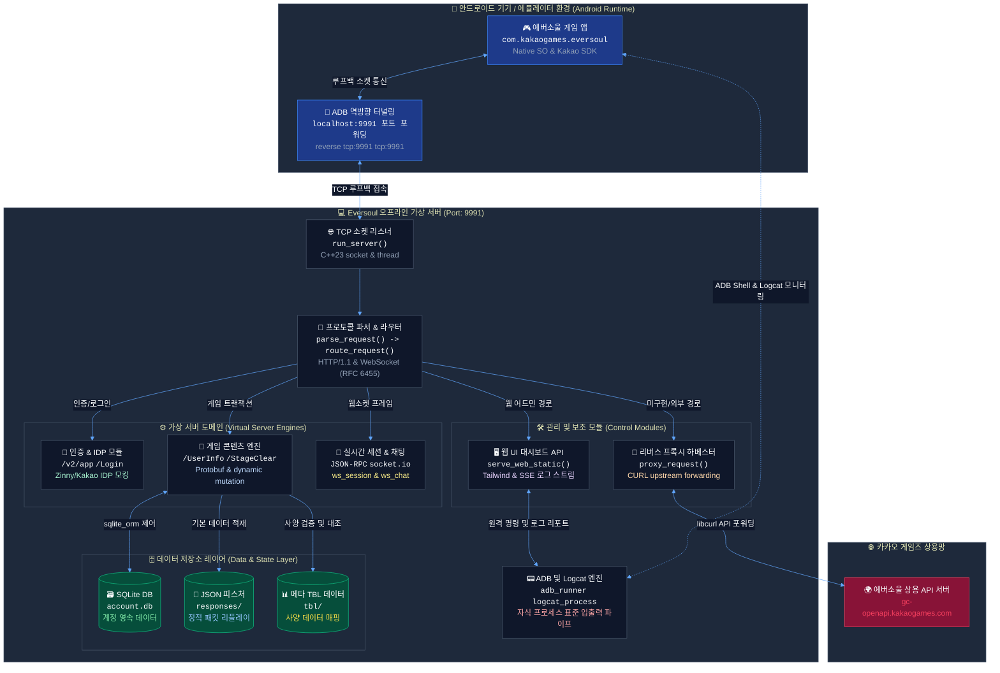

<p align="center">
  
</p>

<h1 align="center">Eversoul Offline</h1>
<h3 align="center">에버소울 오프라인 프로젝트</h3>

<p align="center">
  에붕쿤들의 즐거운 에덴 생활 보장을 위한 구조선
</p>

<p align="center">
  <a href="https://discord.gg/ZptEmqfuv"></a>
  &nbsp;
  
  &nbsp;
  
  &nbsp;
  
  &nbsp;
  
</p>

<p align="center">
  <a href="README_en.md"></a>
  &nbsp;
  <a href="README_cn.md"></a>
  &nbsp;
  
</p>


---

## 🗺️ 전체 시스템 아키텍처 (Architecture)

에버소울 오프라인 프로젝트의 전체 가상 서버 시스템 및 네트워크 흐름도입니다. 안드로이드 기기나 에뮬레이터에서 발생하는 모든 네트워크 요청을 로컬 PC 서버로 유도하여 가상으로 응답을 리플레이하고 영속성을 처리합니다.



## 📂 세부 아키텍처 및 핵심 서버 명세서

에버소울 오프라인 서버의 세부 구성 요소 및 모듈별 심층 마크다운 기술 문서입니다.
*   [종합 아키텍처 개요 명세서 (architecture.md)](docs/architecture.md): 시스템 전반의 디렉터리 구성 및 라이프사이클 흐름.
*   [Zinny / Kakao IDP 인증 서버 명세 (auth_server.md)](docs/auth_server.md): 앱 인포데스크, 기기 로그인 및 가짜 세션 발행 원리.
*   [Mock 게임 프로토콜 및 데이터베이스 명세 (game_server.md)](docs/game_server.md): Protobuf 암복호화, SQLite ORM 기반 계정 상태 관리 및 동적 상태 변이 규칙.
*   [리버스 프록시 및 API 하베스터 명세 (proxy_server.md)](docs/proxy_server.md): libcurl 포워딩 및 report_API 자동 수집 프레임워크.
*   [실시간 웹소켓 & socket.io Replay 명세 (websocket_server.md)](docs/websocket_server.md): 실시간 세션 푸시 및 웹소켓 프레임 처리 흐름.
*   [웹 UI 대시보드 및 REST API 명세 (web_ui_server.md)](docs/web_ui_server.md): 웹 UI 대시보드 리소스 서빙 및 로그 스트리밍(SSE) API.
*   [ADB 인젝터 & Logcat 진단 모듈 명세 (adb_injector.md)](docs/adb_injector.md): reverse 포트 포워딩 자동화 및 실시간 원격 앱 진단 제어.

## 📊 에버소울 서버 구현 진행 현황 및 아키텍처 철학 (Architecture Mandate)

기존 0.0.3 버전까지의 아키텍처는 HAR 덤프에서 추출한 정적 JSON 픽스쳐에 크게 의존했으나, 심층 분석 결과 **전투, 출석, 잠재능력(Zodiac) 등 핵심 컨텐츠에서 `__format__: empty` 오염 및 상태 동기화 누락으로 인한 확정적 소프트락(무한로딩)이 발생함**을 증명하였습니다.

이에 따라 현재 프로젝트는 정적 JSON 픽스쳐 의존성에서 완벽히 탈피하여, **359개의 TBL JSON 메타데이터와 SQLite AccountDB를 실시간 룩업(Lookup)하여 Protobuf를 서버단에서 동적 조립(Dynamic Assembly)하는 100% C++ 네이티브 백엔드 라우팅 시스템**으로 전면 재설계 및 전환 중입니다.

### 핵심 구현 상태 (Dynamic Backend Status)

| 영역 | 상태 | 구현 근거 및 아키텍처 |
| --- | --- | --- |
| **서버 인입 및 인증** | 완료 | TCP/HTTP 라우팅, `offline-zat-` 세션 관리, Kakao SDK 우회 처리 완벽 제어 |
| **핵심 스키마 통신** | 완료 | Google Protobuf 커스텀 런타임 인코딩/디코딩, 64비트 정밀도 자체 JSON 파서 탑재 |
| **TBL 런타임 결합** | **전환 중** | `TblStore`를 통해 로드된 359개 정적 데이터를 유저 DB와 교차 검증하여 응답 동적 생성 |
| **치명적 결함 조치** | 진행 중 | 출석부(`Attendance`), 잠재능력(`Zodiac`), DJ소울 등 빈 응답(0 byte)으로 멈추던 엔드포인트를 C++ 라우터로 이관 완료 |
| **디버깅 덤프 시스템** | 완료 | ADB 9991 터널링 기반 실시간 Unity/C# FlatBuffers 및 카탈로그 통신 가로채기 |
| **번들 및 리소스** | 진행 중 | Addressables 에셋 번들 로컬 서빙(`/Live/`) 최적화 및 무결성 인증 우회 |

> **중요**: 향후 기여 시, 픽스쳐를 단순히 덮어씌우는 방식(`prefer_fixtures`)의 사용을 금지하며, 반드시 `account_db.cpp`와 `dynamic_endpoint_dispatcher.cpp`를 통해 TBL을 연계하는 완전한 C++ 로직을 작성해야 합니다.

## 🎮 에뮬레이터 환경 설정 & ADB 연결 가이드 (FAQ)

현재 모바일 환경(순정 안드로이드 기기)은 패킷 가로채기 및 후킹 패치 처리가 어렵기 때문에, **윈도우 PC 가상 서버와 안드로이드 에뮬레이터 조합**을 통해서만 원활한 플레이가 가능합니다.

### 1. 필수 리소스 다운로드
*   **패치 완료된 에버소울 APK**: [구글 드라이브 다운로드 폴더](https://drive.google.com/file/d/1JMKxagfbuIBbwPtxyTbj0-CzkaJlRMEj/view?usp=sharing)
*   **권장 에뮬레이터 (MuMu Player V5.28.0)**: [뮤뮤 플레이어 직링크 다운로드](https://a11.gdl.netease.com/MuMu-setup-V5.28.0.3580-overseas-0522191800.exe) (기타 LDPlayer 9 등 안드로이드 64비트 가상화 에뮬레이터도 지원합니다.)

### 2. 에뮬레이터 필수 설정 방법
1.  **루팅 권한 활성화**: 에뮬레이터의 `기기 세부 설정` 또는 `시스템 설정`에 진입하여 **루팅(Root) 권한을 반드시 활성화**하십시오.
2.  **ADB 원격 접속 활성화**: 에뮬레이터 설정의 개발자 옵션 또는 기본 디바이스 설정에서 **ADB 원격 접속(USB 디버깅)을 활성화** 상태로 변경하십시오.
3.  **ADB 연결 포트 확인**:
    *   MuMu Player의 경우, 우측 상단 메뉴(`...`) ➡️ [기기 정보] 또는 [진단 정보] ➡️ [네트워크 정보] 탭에 가시면 기기별 **ADB 내부 포트 및 외부 포트**가 명시되어 있습니다. (예: `127.0.0.1:16384` 또는 `127.0.0.1:5555`)

### 3. 서버 연동 및 adb reverse 터널링
1.  오프라인 서버(`eversoul_console.exe`)를 실행합니다.
2.  브라우저를 열어 가상 서버 웹 UI 대시보드 `http://localhost:9991/web/`에 접속합니다.
3.  대시보드 화면 상단의 ADB Injector 입력창에 앞서 에뮬레이터 진단 정보에서 확인한 **ADB 접속 포트(예: 16384)**를 입력한 뒤 연결(Connect)을 클릭합니다.
4.  서버가 백그라운드에서 `adb connect` 및 `adb reverse tcp:9991 tcp:9991` 터널링을 자동으로 수행하여 게임 클라이언트의 모든 패킷이 윈도우 가상 서버로 올바르게 릴레이됩니다.

## 🛠️ 빌드 및 검증 방법

본 PC Fixture 서버 작업은 Git Bash 기준으로 수행합니다. Android SO 빌드는 이 저장소의 현재 백엔드 구현 범위가 아닙니다.

```bash
cmake -S . -B build/cmd -DCMAKE_BUILD_TYPE=Release
cmake --build build/cmd --target eversoul_console encoder_validate offline_data_test orm_seed_check -j"$(nproc)"
```

컴파일 완료 후, 아래의 단위 테스트 바이너리를 실행하여 무결성 검증을 완료할 수 있습니다.

```bash
# 프로토콜 인코더 무결성 검증
./build/cmd/encoder_validate

# 오프라인 데이터 및 프로필 구조 로드 테스트
./build/cmd/offline_data_test build/cmd/offline_data/libofflinedata.so UserInfo
```
