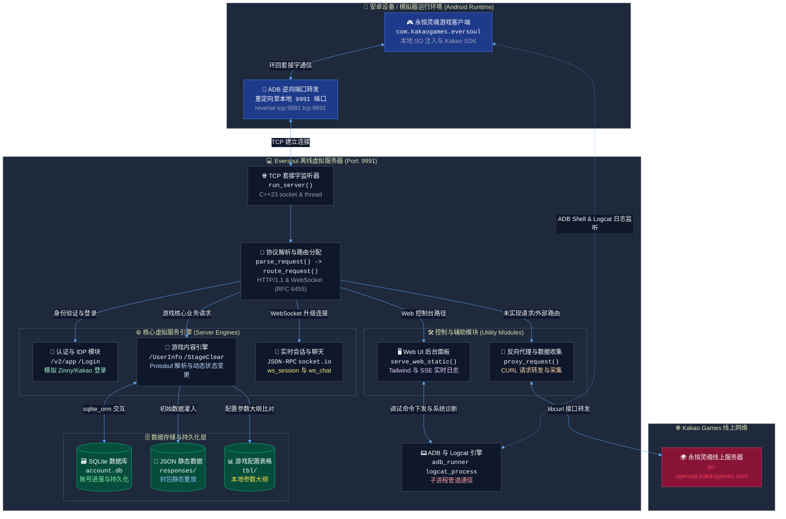

<p align="center">
  
</p>

<h1 align="center">Eversoul Offline</h1>
<h3 align="center">永恒灵魂离线版服务器项目</h3>

<p align="center">
  专为永恒灵魂玩家设计的本地虚拟离线服务器，用以保存和继续我们的伊甸园之旅。
</p>

<p align="center">
  <a href="https://discord.gg/ZptEmqfuv"></a>
  &nbsp;
  
  &nbsp;
  
  &nbsp;
  
  &nbsp;
  
</p>

<p align="center">
  <a href="README_en.md"></a>
  &nbsp;
  
  &nbsp;
  <a href="README.md"></a>
</p>

---

## 🗺️ 全局系统架构 (Architecture)

本架构图展示了离线版本地服务器的整体网络拓扑和请求流向。通过将模拟器或安卓真机的网络请求重定向至本地 PC 服务器，以实现本地响应重放和账号进度的持久化。



## 📂 详细架构及核心模块设计文档

*(提示：下述技术架构及模块设计详细文档均维持韩文撰写。)*
*   [全局架构概述文档 (docs/architecture.md)](docs/architecture.md): 详细记录系统整体目录结构、各 C++ 模块职责及编译输出路径。
*   [Zinny / Kakao IDP 认证模块 (docs/auth_server.md)](docs/auth_server.md): 模拟 App 签名校验（`infodesk_sig`）、客户端设备登录并分发会话令牌（`zat`/`zrt`）。
*   [游戏内容服务及 SQLite 持久化 (docs/game_server.md)](docs/game_server.md): 封包结构直通重放、`sqlite_orm` 数据库交互及角色抽取、关卡清理等状态变更服务。
*   [反向代理与数据自动哈希捕获 (docs/proxy_server.md)](docs/proxy_server.md): 基于 `libcurl` 智能分发线上路由、并剥离头部保存原始 Protobuf 数据至 `report_API/` 的数据抓取器。
*   [实时 WebSocket 与 socket.io 重播服务 (docs/websocket_server.md)](docs/websocket_server.md): 多线程套接字心跳监听、JSON-RPC 与客户端实时广播更新服务。
*   [Web UI 管理后台及 API (docs/web_ui_server.md)](docs/web_ui_server.md): 前端页面静态资源分发与 Server-Sent Events (SSE) 管道实时日志投递。
*   [ADB 辅助及 Logcat 日志捕获模块 (docs/adb_injector.md)](docs/adb_injector.md): 安卓逆向网络管道自动创建与 Unity Player 日志多线程拦截器。

## 📊 永恒灵魂服务器实现进度与架构使命 (Architecture Mandate)

在 0.0.3 版本之前，本项目的架构严重依赖于从 HAR 抓包中提取的静态 JSON 数据（Fixtures）。然而，我们通过深入分析证实，**这种方法会导致在战斗、签到、潜力（Zodiac）等核心功能中，由于 `__format__: empty` 数据污染和状态不同步，产生必然的软锁定（无限加载）问题。**

因此，本项目目前已完全摆脱对静态 JSON 数据的依赖。我们正在全面重构并过渡到 **100% C++ 原生后端路由系统：该系统通过实时查找 359 个 TBL JSON 元数据和 SQLite AccountDB，在服务器端动态组装 Protobuf 响应。**

### 核心实现状态 (Dynamic Backend Status)

| 模块领域 | 状态 | 实现依据与架构 |
| --- | --- | --- |
| **服务器入口与认证** | 已完成 | TCP/HTTP 路由分配，`offline-zat-` 会话管理，以及 Kakao SDK 绕过处理完美受控 |
| **核心 Schema 通信** | 已完成 | Google Protobuf 自定义运行时编码/解码，内置 64 位精度的专有 JSON 解析器 |
| **TBL 运行时集成** | **过渡中** | 通过 `TblStore` 交叉验证 359 个静态数据表与用户数据库，动态生成响应 |
| **致命缺陷修复** | 进行中 | 已成功将诸如签到 (`Attendance`)、潜力 (`Zodiac`) 和 DJ Soul 等因空响应 (0 字节) 而卡死的端点迁移至 C++ 路由器 |
| **调试与抓包系统** | 已完成 | 基于 ADB 9991 隧道，实时拦截 Unity/C# FlatBuffers 和 Catalog 目录通信 |
| **资源包与本地化** | 进行中 | 优化 Addressables 资源包本地分发 (`/Live/`)，并绕过完整性认证 |

> **重要提示**：在未来的代码贡献中，严格禁止使用简单的静态数据覆盖（`prefer_fixtures`）方式。必须编写通过 `account_db.cpp` 和 `dynamic_endpoint_dispatcher.cpp` 关联 TBL 数据的完整 C++ 逻辑。

## 🎮 模拟器环境配置与 ADB 连接指南 (FAQ)

由于在纯净的安卓手机上拦截封包和进行 Hook 补丁存在技术难度，目前推荐使用 **Windows PC 本地服务器 + 安卓模拟器** 的组合进行顺畅游戏。

### 1. 下载必需资源
*   **已打补丁的永恒灵魂 APK**: [谷歌网盘下载文件夹](https://drive.google.com/file/d/1JMKxagfbuIBbwPtxyTbj0-CzkaJlRMEj/view?usp=sharing)
*   **推荐模拟器 (MuMu 模拟器 V5.28.0)**: [MuMu 模拟器安装包下载 (直链)](https://a11.gdl.netease.com/MuMu-setup-V5.28.0.3580-overseas-0522191800.exe) (其他 64 位安卓虚拟化模拟器如雷电模拟器 9 亦可支持。)

### 2. 模拟器必备设置步骤
1.  **开启 Root 权限**: 进入模拟器的 `设置中心` 或 `系统设置` ➡️ **务必开启 Root 权限**。
2.  **开启 ADB 远程连接**: 在模拟器的开发者选项或设备基础设置中 ➡️ **务必启用 ADB 远程连接（或 USB 调试）**。
3.  **获取 ADB 连接端口**:
    *   对于 MuMu 模拟器，点击右上角菜单栏 (`...`) ➡️ [设备信息] 或 [诊断信息] ➡️ [网络信息] 页面，在该页面可查询到当前模拟器实例专属的 **ADB 内部/外部连接端口** (例如：`127.0.0.1:16384` 或 `127.0.0.1:5555`)。

### 3. 服务器对接与 adb reverse 逆向隧道配置
1.  启动本地离线服务器 (`eversoul_console.exe`)。
2.  打开浏览器访问本地虚拟服务器 Web UI 控制台: `http://localhost:9991/web/`。
3.  在控制台顶部的 ADB Injector 输入框中，填入前面从模拟器诊断信息中获取的 **ADB 连接端口（例如：16384）**，然后点击连接 (Connect)。
4.  虚拟服务器将在后台自动执行 `adb connect` 以及 `adb reverse tcp:9991 tcp:9991` 隧道连接，使游戏客户端的所有封包请求完美路由至本地 PC 服务器。

## 🛠️ 构建与测试说明

本项目支持在 Windows 系统下通过 Git Bash 环境进行静态样式生成、C++ 项目生成与库文件拷贝。

```bash
# 1. 编译 Tailwind 样式并全量生成 eversoul_console 的 Release 版本
./bs.ps1

# 2. 编译安卓 JNI 劫持动态链接库 (可选)
./ba.ps1
```

构建成功后，运行对应的验证程序以确保一切正常：
```bash
# 运行 Protobuf 编码序列化测试
./build/cmd/encoder_validate

# 运行本地数据结构与配置文件读取测试
./build/cmd/offline_data_test build/cmd/offline_data/libofflinedata.so UserInfo
```
