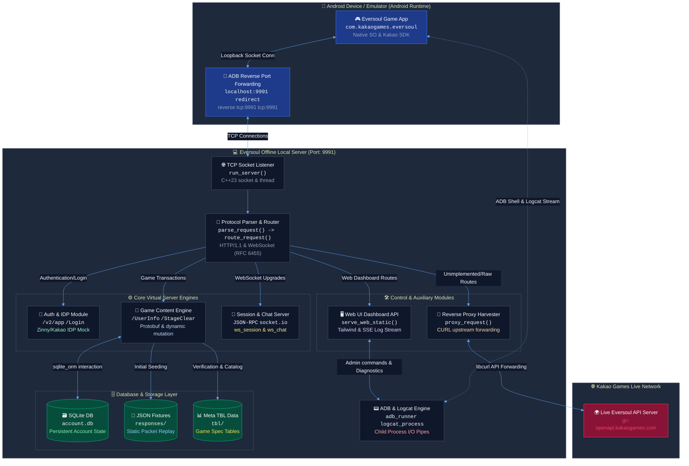

<p align="center">
  
</p>

<h1 align="center">Eversoul Offline</h1>
<h3 align="center">Eversoul Offline Project</h3>

<p align="center">
  Eversoul offline local server environment to preserve our Eden life.
</p>

<p align="center">
  <a href="https://discord.gg/ZptEmqfuv"></a>
  &nbsp;
  
  &nbsp;
  
  &nbsp;
  
  &nbsp;
  
</p>

<p align="center">
  
  &nbsp;
  <a href="README_cn.md"></a>
  &nbsp;
  <a href="README.md"></a>
</p>

---

## 🗺️ Overall System Architecture

This flowchart illustrates the offline virtual server network layout and execution pipeline. The network requests from the mobile app client or emulator are transparently redirected to the local PC server to play back mock responses and persist account state.



## 📂 Detailed Architecture & Core Server Specifications

*(Note: Detailed specification documents are maintained in Korean.)*
*   [Overall Architecture Specification (docs/architecture.md)](docs/architecture.md): High-level system structure, directories, and compilation output pipelines.
*   [Zinny / Kakao IDP Authentication Server (docs/auth_server.md)](docs/auth_server.md): Details on App Infodesk (`infodesk_sig`), device login validation, and token issue.
*   [Mock Game Protocol & SQLite DB Specification (docs/game_server.md)](docs/game_server.md): Raw packet bypass logic, sqlite_orm database design, and state mutators.
*   [Reverse Proxy & Harvester Specification (docs/proxy_server.md)](docs/proxy_server.md): libcurl routing division and automatically recorded `report_API/` data harvester.
*   [Real-time WebSocket & socket.io Replay (docs/websocket_server.md)](docs/websocket_server.md): Multi-thread push notification socket, JSON-RPC, and engine.io poll handler.
*   [Web UI Dashboard & REST API (docs/web_ui_server.md)](docs/web_ui_server.md): Static Web UI asset loading and Server-Sent Events (SSE) log stream channel.
*   [ADB Injector & Logcat Diagnostic Module (docs/adb_injector.md)](docs/adb_injector.md): Automated reverse tunnel port config and Unity player log collector.

## 📊 Eversoul Server Implementation Progress & Architecture Mandate

Until version 0.0.3, the architecture heavily relied on static JSON fixtures extracted from HAR dumps. However, our in-depth analysis proved that **this approach causes deterministic soft-locks (infinite loading) in core contents like Battles, Attendance, and Zodiac due to `__format__: empty` corruption and state desynchronization.**

Consequently, this project is completely breaking away from static JSON fixture dependencies. We are fully redesigning and transitioning to a **100% C++ native backend routing system that performs real-time lookups on 359 TBL JSON metadata and the SQLite AccountDB to dynamically assemble Protobuf responses at the server level.**

### Core Implementation Status (Dynamic Backend Status)

| Category | Status | Implementation Basis & Architecture |
| --- | --- | --- |
| **Server Ingress & Auth** | Complete | TCP/HTTP routing, `offline-zat-` session management, and Kakao SDK bypass perfectly controlled |
| **Core Schema Comm.** | Complete | Google Protobuf custom runtime encode/decode, bundled with a 64-bit precision JSON parser |
| **TBL Runtime Integration** | **Transitioning** | Dynamically generates responses by cross-validating 359 static tables loaded via `TblStore` with user DB |
| **Critical Defect Fixes** | In Progress | Successfully migrated endpoints that stalled with empty responses (0 byte) like `Attendance`, `Zodiac`, and DJ Soul to the C++ router |
| **Debugging Dump Sys.** | Complete | Real-time Unity/C# FlatBuffers and catalog communication interception via ADB 9991 tunneling |
| **Bundle & Resources** | In Progress | Optimizing Addressables asset bundle local serving (`/Live/`) and bypassing integrity auth |

> **IMPORTANT**: For future contributions, the use of simple fixture overrides (`prefer_fixtures`) is strictly prohibited. You must write complete C++ logic that links TBLs via `account_db.cpp` and `dynamic_endpoint_dispatcher.cpp`.

## 🎮 Emulator Config & ADB Connection Guide (FAQ)

Currently, running the game on a raw Android mobile device is difficult due to packet interception and hooking constraints. Therefore, it is highly recommended to play using a **Windows PC Virtual Server + Android Emulator** combination.

### 1. Download Required Resources
*   **Patched Eversoul APK**: [Google Drive Download Folder](https://drive.google.com/file/d/1JMKxagfbuIBbwPtxyTbj0-CzkaJlRMEj/view?usp=sharing)
*   **Recommended Emulator (MuMu Player V5.28.0)**: [MuMu Player Setup Download (Direct Link)](https://a11.gdl.netease.com/MuMu-setup-V5.28.0.3580-overseas-0522191800.exe) (Other 64-bit virtualization emulators like LDPlayer 9 are also supported.)

### 2. Required Emulator Configuration
1.  **Enable Root Permission**: Enter the emulator's `Device Settings` or `System Settings` and **make sure Root Permission is enabled**.
2.  **Enable ADB Remote Connection**: Go to the Developer Options or System Configuration of the emulator and **enable ADB Remote Connection (or USB Debugging)**.
3.  **Find the ADB Connection Port**:
    *   For MuMu Player, click the top-right menu icon (`...`) ➡️ [Device Info (or Diagnostics)] ➡️ [Network Info] tab. You will find the specific **ADB internal/external port** allocated for this instance (e.g., `127.0.0.1:16384` or `127.0.0.1:5555`).

### 3. Server Interconnection & adb reverse Tunneling
1.  Run the local virtual server (`eversoul_console.exe`).
2.  Open your browser and navigate to the Web UI dashboard: `http://localhost:9991/web/`.
3.  In the ADB Injector input field at the top of the dashboard, enter the **ADB connection port (e.g., 16384)** that you found in the emulator, then click Connect.
4.  The server automatically executes `adb connect` and `adb reverse tcp:9991 tcp:9991` in the background, smoothly routing all game client packets to the Windows local server.

## 🛠️ Build & Verification Guide

This project is built under Windows using Git Bash. It integrates Tailwind CSS generation, CMake build files, and runtime library distribution.

```bash
# 1. Compile Tailwind styles and build eversoul_console binaries
./bs.ps1

# 2. Build Android JNI Redirect Hook library (optional)
./ba.ps1
```

After building, execute validation binaries to confirm everything is consistent:
```bash
# Verify Protobuf encoder consistency
./build/cmd/encoder_validate

# Verify binary loader structures
./build/cmd/offline_data_test build/cmd/offline_data/libofflinedata.so UserInfo
```
