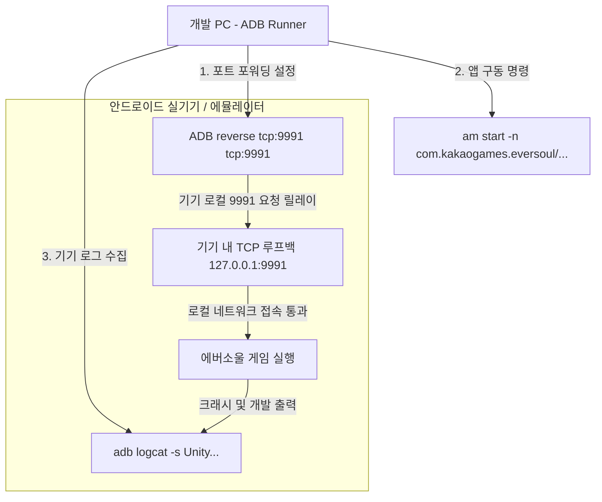

# ADB 인젝터 기능 명세서 (adb_injector.md)

이 문서는 에버소울 오프라인 PC 서버의 안드로이드 기기 제어, 리버스 포트 포워딩 자동화 및 ADB(Android Debug Bridge) 프로세스 연동 모듈에 대하여 상세히 기술합니다.

---

## 1. 개요 및 인젝션 자동화의 중요성
에버소울 모바일 클라이언트는 기본적으로 상용 도메인 주소로 접속을 시도하므로, 로컬 PC 서버(`127.0.0.1:9991`)를 타겟으로 바라보게 만들기 위해 안드로이드 네트워크 라우팅을 변조해야 합니다. 
본 프로젝트는 **ADB 인젝터 모듈**을 포함하여 기기 연결부터 포트 포워딩 및 게임 실행까지의 과정을 클릭 한 번으로 자동화합니다.

---

## 2. ADB 인젝터 통신 및 제어 API 구현

### 2.1 기기 감지 및 포트 리버스 포워딩 (`adb_runner.cpp`)
*   **자체 바이너리 바인딩**: `copy_only/adb/` 하위에 위치한 경량화된 윈도우용 `adb.exe` 및 종속 DLL 파일들을 탐색하여 서브프로세스로 실행시킵니다.
*   **윈도우 파이프 제어 구현**:
    *   `adb_runner::run()` 메서드는 윈도우 API인 `CreatePipe`를 활용하여 익명 파이프(Anonymous Pipe)를 생성하고 쓰기 핸들(`hWrite`)을 자식 프로세스의 표준 출력(`hStdOutput`) 및 표준 에러(`hStdError`)에 리다이렉션합니다.
    *   `CreateProcessA`를 호출하여 백그라운드에서 `adb.exe` 명령어를 구동한 후, 자식 프로세스가 완료될 때까지 대기하거나 읽기 핸들(`hRead`)을 통해 문자열 출력을 끝까지 가져와 결과를 조립합니다.
*   **기기 검색 (`GET /web/api/injector/devices`)**:
    *   `adb devices` 명령을 실행해 연결되어 있는 기기 목록의 일련번호(Serial) 정보를 문자열 패턴 매칭으로 파싱합니다.
*   **자동 프로브 연결 (`POST /web/api/adb/probe`)**:
    *   `adb connect`를 시도하여 원격 에뮬레이터 포트 및 IP 연결을 수립합니다.
    *   필요시 `adb root`를 전달해 보안 셸을 획득하고, 데몬이 재부팅되는 동안 `wait-for-device`로 대기 제어합니다.
    *   최종적으로 **`adb reverse tcp:9991 tcp:9991`** 규칙을 인젝션합니다. 이로 인해 기기 내부의 포트 `9991` 요청은 PC의 `9991` TCP 수신 소켓으로 투명하게 역터널링됩니다.

---

## 3. Logcat 로깅 모니터링 엔진 (`logcat_process.cpp`)
*   **비동기 독자 스레드 감시**:
    *   `logcat::start()`가 호출되면 지정된 기기 일련번호를 타겟으로 하여 `adb.exe -s <serial> logcat -v time` 자식 프로세스를 독자적인 `std::thread` 내에 생성합니다.
    *   마찬가지로 익명 파이프를 통해 들어오는 로우 바이트(Raw Bytes) 출력 스트림을 실시간 감시합니다.
*   **행 단위 파싱 루프**:
    *   스레드 루프 내에서 고정 크기 버퍼(`8192` 바이트)로 파이프를 계속 Read합니다.
    *   수신된 데이터 청크는 내장 버퍼에 누적되며, 개행 문자(`\n` 또는 `\r\n`)를 만날 때마다 개별 로그 행(Line)으로 쪼개집니다.
    *   개행된 라인에서 유니티 엔진 태그(`Unity`), 카카오 SDK 태그, 혹은 특정 치명적 예외 필터를 탐지하여 실시간 디버거에 노출할 타겟 로그를 선별합니다.
*   **SSE 전송 브로드캐스트**:
    *   필터링된 로그 객체는 `sse_log_broadcast()` API를 경유하여, `router.cpp` 내의 `/web/api/log/stream` HTTP 커넥션을 유지하고 있는 관찰자 클라이언트 웹 UI 브라우저로 SSE(Server-Sent Events) 스트림 데이터를 즉시 전송합니다.

---

## 4. 소스 코드 클래스 및 함수 설계 명세

안드로이드 에뮬레이터 및 디바이스 제어를 자동화하는 주요 소스 파일 및 함수 구조입니다.

### 4.1 관련 소스 파일 구성
*   **`src/platform/adb/adb_runner.cpp`**: Windows API 기반 익명 파이프 제어 및 `CreateProcessA` 연동을 담당하는 ADB 인터페이스 엔진.
*   **`src/platform/adb/logcat_process.cpp`**: `adb logcat`을 지속형 비동기 스레드로 구동하며 에버소울 로그 라인을 추출하여 SSE 채널로 푸시하는 엔진.
*   **`src/core/logging/sse_log.cpp`**: 서버 내부 로그 및 ADB 수집 로그를 관찰자 패턴으로 바인딩하여 HTTP 클라이언트에 SSE 채널로 브로드캐스트하는 로그 관리자.

### 4.2 주요 핵심 함수 설계
*   `std::string adb_runner::adb_path()`:
    *   **역할**: 윈도우용 실행 경로인 `copy_only/adb/adb.exe`가 실재하는지 탐색하고, 누락 시 환경 변수 상의 시스템 adb를 예비로 추적하여 최적의 실행 경로를 확보합니다.
*   `std::string adb_runner::run(const std::vector<std::string> &args)`:
    *   **역할**: 주어진 명령어 인수 배열(`args`)을 조립하여 `CreateProcessA` 윈도우 API를 활용해 자식 프로세스로 실행시키고, 익명 파이프(`Anonymous Pipe`)를 통해 기기 출력을 가로채 문자열로 반환합니다.
*   `void logcat::start(const std::string &adb_exe, const std::string &serial)`:
    *   **역할**: 지정된 기기 일련번호(`serial`)를 타겟으로 비동기 스레드를 열어 `adb logcat` 스트림을 지속 감시하고 개행 버퍼 단위로 끊어 `sse_log` 메모리 큐에 실시간 적재합니다.

