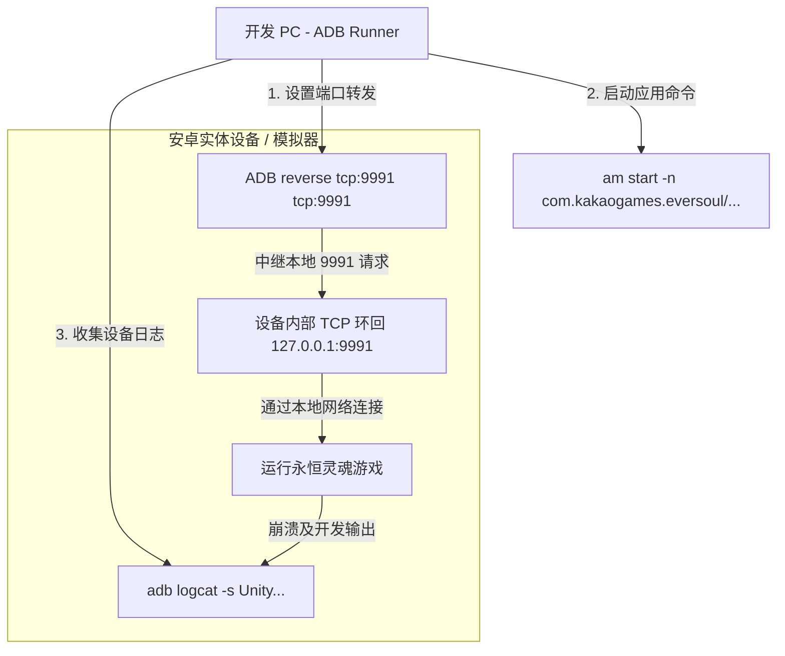

# ADB 注入器功能说明书 (adb_injector.md)

本文档详细介绍了永恒灵魂离线 PC 服务器的安卓设备控制、反向端口转发自动化以及 ADB (Android Debug Bridge) 进程联动模块。

---

## 1. 概述与注入自动化的重要性
由于永恒灵魂移动端客户端默认会尝试连接商用域名地址，为了让其目标指向本地 PC 服务器 (`127.0.0.1:9991`)，我们必须篡改安卓网络路由。
本项目包含 **ADB 注入器模块**，通过一键点击即可自动化完成从设备连接到端口转发以及游戏启动的全过程。

---

## 2. ADB 注入器通信与控制 API 实现

### 2.1 设备检测与反向端口转发 (`adb_runner.cpp`)
*   **自带二进制绑定**: 搜索位于 `copy_only/adb/` 目录下的轻量级 Windows 用 `adb.exe` 及其依赖 DLL 文件，并作为子进程执行。
*   **Windows 管道控制实现**:
    *   `adb_runner::run()` 方法利用 Windows API `CreatePipe` 创建匿名管道 (Anonymous Pipe)，并将其写入句柄 (`hWrite`) 重定向至子进程的标准输出 (`hStdOutput`) 和标准错误 (`hStdError`)。
    *   调用 `CreateProcessA` 在后台运行 `adb.exe` 命令后，等待子进程完成，或者通过读取句柄 (`hRead`) 不断获取字符串输出以组装结果。
*   **设备搜索 (`GET /web/api/injector/devices`)**:
    *   执行 `adb devices` 命令，并通过字符串模式匹配解析已连接设备的序列号 (Serial) 信息。
*   **自动探测连接 (`POST /web/api/adb/probe`)**:
    *   尝试 `adb connect` 以建立远程模拟器端口和 IP 连接。
    *   必要时传递 `adb root` 以获取安全 Shell，并使用 `wait-for-device` 控制守护进程重启期间的等待。
    *   最后，注入 **`adb reverse tcp:9991 tcp:9991`** 规则。由此，设备内部针对端口 `9991` 的请求将被透明地反向隧道传输至 PC 的 `9991` TCP 接收套接字。

---

## 3. Logcat 日志监控引擎 (`logcat_process.cpp`)
*   **异步读取器线程监控**:
    *   调用 `logcat::start()` 时，以指定的设备序列号为目标，在一个独立的 `std::thread` 中生成 `adb.exe -s <serial> logcat -v time` 子进程。
    *   同样地，实时监控通过匿名管道传入的原始字节 (Raw Bytes) 输出流。
*   **按行解析循环**:
    *   在线程循环内使用固定大小的缓冲区 (`8192` 字节) 不断读取管道。
    *   接收到的数据块累积在内部缓冲区中，每当遇到换行符 (`\n` 或 `\r\n`) 时，便被拆分为单独的日志行。
    *   在拆分后的行中探测 Unity 引擎标签 (`Unity`)、Kakao SDK 标签或特定的致命异常过滤器，从而筛选出要暴露给实时调试器的目标日志。
*   **SSE 传输广播**:
    *   过滤后的日志对象通过 `sse_log_broadcast()` API，立即作为 SSE (Server-Sent Events) 流数据发送给在 `router.cpp` 中保持着 `/web/api/log/stream` HTTP 连接的观察者客户端 Web UI 浏览器。

---

## 4. 源代码类与函数设计规范

以下为自动化安卓模拟器及设备控制的主要源文件及函数结构。

### 4.1 相关源文件结构
*   **`src/platform/adb/adb_runner.cpp`**: 负责基于 Windows API 的匿名管道控制及 `CreateProcessA` 联动的 ADB 接口引擎。
*   **`src/platform/adb/logcat_process.cpp`**: 将 `adb logcat` 作为持续的异步线程运行，提取永恒灵魂日志行并将其推送到 SSE 通道的引擎。
*   **`src/core/logging/sse_log.cpp`**: 将服务器内部日志和 ADB 收集的日志以观察者模式绑定，并通过 SSE 通道广播给 HTTP 客户端的日志管理器。

### 4.2 主要核心函数设计
*   `std::string adb_runner::adb_path()`:
    *   **作用**: 搜索 Windows 执行路径 `copy_only/adb/adb.exe` 是否存在，若缺失，则追踪环境变量中的系统 adb 作为备用，以确保获取最佳执行路径。
*   `std::string adb_runner::run(const std::vector<std::string> &args)`:
    *   **作用**: 组装给定的命令参数数组 (`args`)，利用 `CreateProcessA` Windows API 作为子进程执行，并通过匿名管道 (Anonymous Pipe) 拦截设备输出并以字符串形式返回。
*   `void logcat::start(const std::string &adb_exe, const std::string &serial)`:
    *   **作用**: 针对指定的设备序列号 (`serial`) 开启异步线程，持续监控 `adb logcat` 流，按换行缓冲区进行切分，并实时加载到 `sse_log` 内存队列中。
