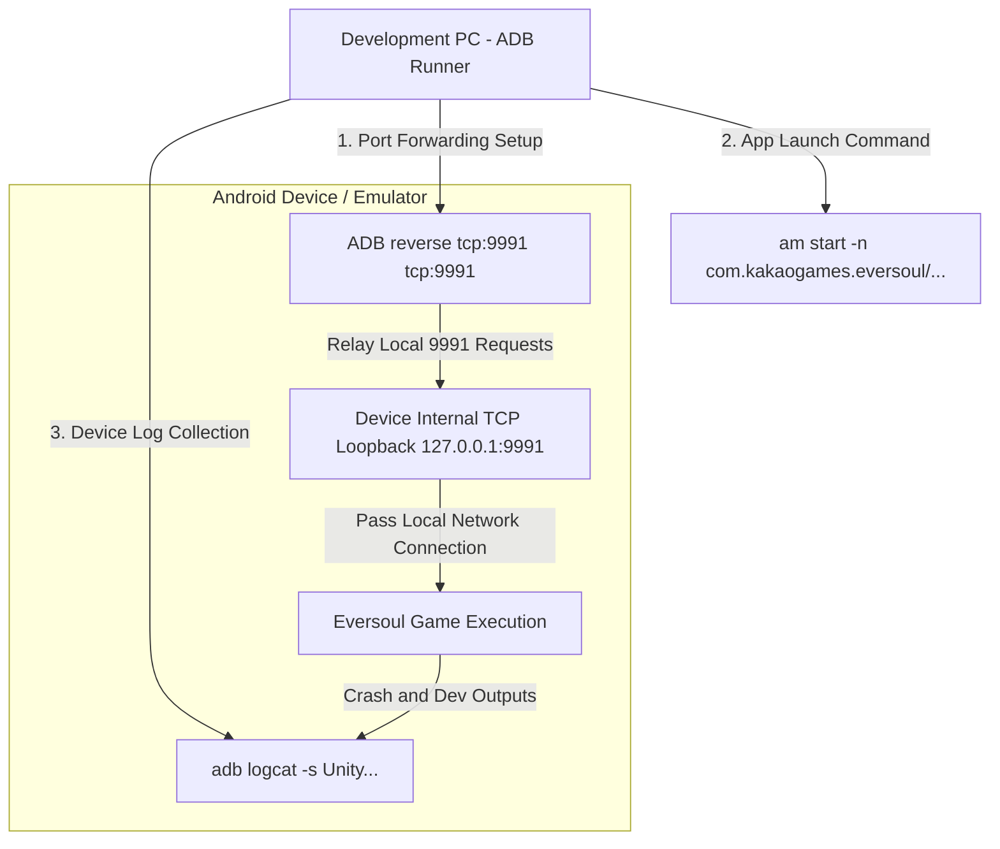

# ADB Injector Feature Specification (adb_injector.md)

This document details the Android device control, reverse port forwarding automation, and Android Debug Bridge (ADB) process integration modules of the Eversoul offline PC server.

---

## 1. Overview and Importance of Injection Automation
Since the Eversoul mobile client natively attempts to connect to commercial domain addresses, we must alter the Android network routing to make it target the local PC server (`127.0.0.1:9991`). 
This project includes an **ADB Injector Module** that automates the entire process from device connection to port forwarding and game execution with a single click.

---

## 2. ADB Injector Communication and Control API Implementation

### 2.1 Device Detection and Port Reverse Forwarding (`adb_runner.cpp`)
*   **Self-Binary Binding**: Searches for the lightweight Windows `adb.exe` and dependent DLL files located under `copy_only/adb/` and executes them as subprocesses.
*   **Windows Pipe Control Implementation**:
    *   The `adb_runner::run()` method utilizes the Windows API `CreatePipe` to create an Anonymous Pipe and redirects the write handle (`hWrite`) to the child process's standard output (`hStdOutput`) and standard error (`hStdError`).
    *   Calls `CreateProcessA` to run the `adb.exe` command in the background, then either waits for the child process to complete or continuously reads the string output via the read handle (`hRead`) to assemble the result.
*   **Device Search (`GET /web/api/injector/devices`)**:
    *   Executes the `adb devices` command and parses the serial number (Serial) information of the connected devices using string pattern matching.
*   **Auto Probe Connection (`POST /web/api/adb/probe`)**:
    *   Attempts `adb connect` to establish a remote emulator port and IP connection.
    *   Passes `adb root` if necessary to acquire a secure shell, and handles waiting during daemon reboots using `wait-for-device`.
    *   Finally, injects the **`adb reverse tcp:9991 tcp:9991`** rule. This causes requests to port `9991` inside the device to be transparently reverse-tunneled to the PC's `9991` TCP receiving socket.

---

## 3. Logcat Logging Monitoring Engine (`logcat_process.cpp`)
*   **Asynchronous Reader Thread Monitoring**:
    *   When `logcat::start()` is called, it targets a specified device serial number and spawns the `adb.exe -s <serial> logcat -v time` child process within an independent `std::thread`.
    *   Similarly, it monitors the raw byte output stream coming through the anonymous pipe in real-time.
*   **Line-by-Line Parsing Loop**:
    *   Continuously reads the pipe with a fixed-size buffer (`8192` bytes) within the thread loop.
    *   The received data chunks are accumulated in an internal buffer and split into individual log lines whenever a newline character (`\n` or `\r\n`) is encountered.
    *   Detects the Unity engine tag (`Unity`), Kakao SDK tags, or specific fatal exception filters from the broken lines to select target logs to expose to the real-time debugger.
*   **SSE Transmission Broadcast**:
    *   Filtered log objects are instantly sent as SSE (Server-Sent Events) stream data to observer client Web UI browsers maintaining the `/web/api/log/stream` HTTP connection in `router.cpp`, via the `sse_log_broadcast()` API.

---

## 4. Source Code Class and Function Design Specifications

This outlines the major source files and function structures that automate Android emulator and device control.

### 4.1 Related Source File Structure
*   **`src/platform/adb/adb_runner.cpp`**: The ADB interface engine responsible for Windows API-based anonymous pipe control and `CreateProcessA` integration.
*   **`src/platform/adb/logcat_process.cpp`**: The engine that runs `adb logcat` as a persistent asynchronous thread, extracts Eversoul log lines, and pushes them to the SSE channel.
*   **`src/core/logging/sse_log.cpp`**: The log manager that binds server internal logs and ADB collected logs using the observer pattern to broadcast them via the SSE channel to HTTP clients.

### 4.2 Major Core Function Design
*   `std::string adb_runner::adb_path()`:
    *   **Role**: Searches for the existence of the Windows execution path `copy_only/adb/adb.exe`, and if missing, tracks the system adb in environmental variables as a fallback to secure the optimal execution path.
*   `std::string adb_runner::run(const std::vector<std::string> &args)`:
    *   **Role**: Assembles the given command argument array (`args`), executes it as a child process using the `CreateProcessA` Windows API, and intercepts the device output via an Anonymous Pipe to return it as a string.
*   `void logcat::start(const std::string &adb_exe, const std::string &serial)`:
    *   **Role**: Opens an asynchronous thread targeting the specified device serial number (`serial`) to continuously monitor the `adb logcat` stream, slices it by newline buffers, and loads it into the `sse_log` memory queue in real-time.
