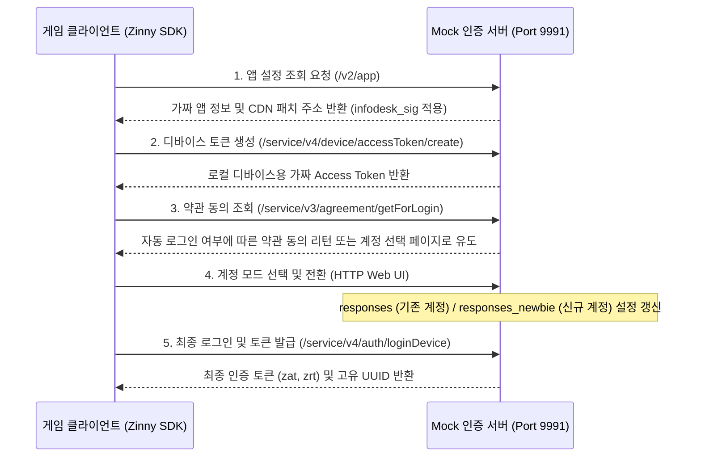

# 인증 서버 기능 명세서 (auth_server.md)

이 문서는 에버소울 오프라인 PC 서버의 카카오/지니(Zinny) 인증 서버 모킹 구현에 대해 상세히 기술합니다.

---

## 1. 개요 및 통신 흐름
에버소울 클라이언트는 게임을 구동할 때 카카오 게임즈의 인증 프레임워크(Zinny SDK)를 사용하여 플레이어 상태 및 보안 검증을 수행합니다. 
오프라인 환경에서는 외부 인증 인프라에 도달하지 못하므로, 본 프로젝트는 이를 완전히 로컬에서 모킹(Mocking)하여 게임 실행의 통과를 보장합니다.

---

## 2. 주요 API 엔드포인트 명세 및 모킹 구현

### 2.4 인포데스크 무결성 서명 연산 (`infodesk_sig`)
*   **서명 요구**: 카카오 SDK는 CDN 서버 리스트와 앱 설정 응답에 대한 무결성 서명 헤더(`infodesk_sig` 또는 `sig`)가 올바르지 않으면 응답을 폐기하고 실행을 중단합니다.
*   **실제 C++ 구현 (`crypto.cpp`)**:
    *   난독화 해제된 10개의 지니 인포데스크 시크릿 키 중 0번째 키인 `"qvjNK+TlAJ"`를 HMAC-SHA256 해시 키로 사용합니다.
    *   JSON 응답 본문 전체를 대상으로 `hmac_sha256()` 연산을 실행하여 32바이트 바이너리 다이제스트를 획득합니다.
    *   획득한 다이제스트를 `base64_encode()`로 문자열 인코딩한 후, 키의 인덱스 번호를 명시하는 `"0;"` 접두사(Prefix)를 붙여 최종 서명값(`"0;base64_hash..."`)을 조립하여 HTTP 응답 헤더로 회신합니다.

---

## 3. 계정 세션 영속화 및 레지스트리 연동
*   **로그인 처리 시의 세션 연계**:
    *   `/service/v4/auth/loginDevice` 및 `loginZinnyDevice` 요청이 들어오면, `router.cpp` 내의 `mock_login_data_response()`가 가짜 `zat`(Access Token) 및 `zrt`(Refresh Token) 토큰 세트를 생성합니다.
    *   생성된 토큰 정보와 로그인 타임스탬프, 기기 고유 ID, `playerId` 등은 `AccountSessionRow` 구조체에 적재됩니다.
    *   이 구조체는 `account_registry().upsert_session()`을 통해 메모리 캐시 및 활성 세션 DB(SQLite)에 기록되어 영속화됩니다.
*   **웹소켓(WebSocket) 연동 흐름**:
    *   클라이언트가 로그인 완료 후 실시간 웹소켓 서버 포트(Kakao Session RPC)로 접속을 시도하면, 인증 단계에서 저장해 둔 `zat` 토큰 값을 조회하여 매칭되는 플레이어 세션을 식별합니다.
    *   세션이 식별되면 `ws_session_default_row()`를 기반으로 세션 데이터를 실시간으로 동적 덮어쓰기 패치하여 클라이언트에 웹소켓 수신 프레임(`initial_push`)으로 즉시 브로드캐스팅해 줍니다.
*   **계정 모드 전환 및 INI 연동**:
    *   사용자의 계정 모드 선택 상태는 로컬 설정 파일(`ini` 저장소)의 `account_profile` 키에 반영됩니다.
        *   `responses`: 기존의 수집된 풍부한 성장 캐릭터 상태를 보존한 모드.
        *   `responses_newbie`: 튜토리얼 시작부터 플레이할 수 있는 빈 신규 계정 모드.
    *   라우터에서 `set_account_mode`를 호출하면 INI 설정을 갱신하고, `fixture_store().load`를 실행하여 해당 모드에 매칭되는 응답 JSON 파일 더미를 가상 데이터 경로에서 새롭게 로드합니다.

---

## 4. 소스 코드 구조 및 설계 명세

인증 모킹 처리를 주도하는 핵심적인 소스 파일 구성 요소와 내부 함수 명세입니다.

### 4.1 관련 소스 파일 구성
*   **`src/server/app/router.cpp`**: 클라이언트의 로그인 및 인증 통신 경로들을 필터링하고 모킹 응답을 바인딩하는 주체.
*   **`src/core/encoding/crypto.cpp`**: SHA-256, HMAC-SHA256, Base64 인코딩 및 카카오 서명 키셋 연산을 직접 구현하는 코어 암호화 모듈.
*   **`src/account/profile/account_registry.cpp`**: 메모리 및 DB 상에 플레이어 인증 세션 테이블(`session`)을 생성하고 `zat`/`zrt` 매핑 상태를 관리하는 레지스트리.
*   **`src/config/ini/ini_store.cpp`**: `eversoul.ini`에 바인딩된 계정 모드 설정 및 CDN 경로 옵션을 스레드 세이프하게 로드/갱신하는 저장소.

### 4.2 주요 핵심 함수 설계
*   `HttpResponse route_request(uint64_t id, int fd, const HttpRequest &req)`:
    *   **역할**: TCP 세션에서 파싱 완료된 요청 객체(`req.path`)의 주소를 분석하여 `/service/v3/*` 및 `/service/v4/*` 관련 인증 핸들러로 전달합니다.
*   `HttpResponse mock_login_data_response(uint64_t id, const std::string &label, const HttpRequest &req, bool is_first_login)`:
    *   **역할**: 요청 바디 내의 `deviceId`와 `playerId` 정보를 정밀하게 검증하여 가짜 로그인 토큰 봉투(`zat`, `zrt`) 구조를 담은 JSON 포맷 바디를 생성하고 `account_registry`에 세션을 동기화합니다.
*   `std::string infodesk_sig(std::string_view body)`:
    *   **역할**: 인포데스크 조회 시 카카오 SDK 내부 라이브러리 검증 과정을 패스할 수 있도록, 본문에 대한 hmac-sha256/base64 서명 값을 도출하여 반환합니다.
*   `bool set_account_mode(AccountMode mode)`:
    *   **역할**: 활성 프로필 계정 모드(`responses` 또는 `responses_newbie`) 값을 시스템 환경설정에 동적 기록 및 보존합니다.

