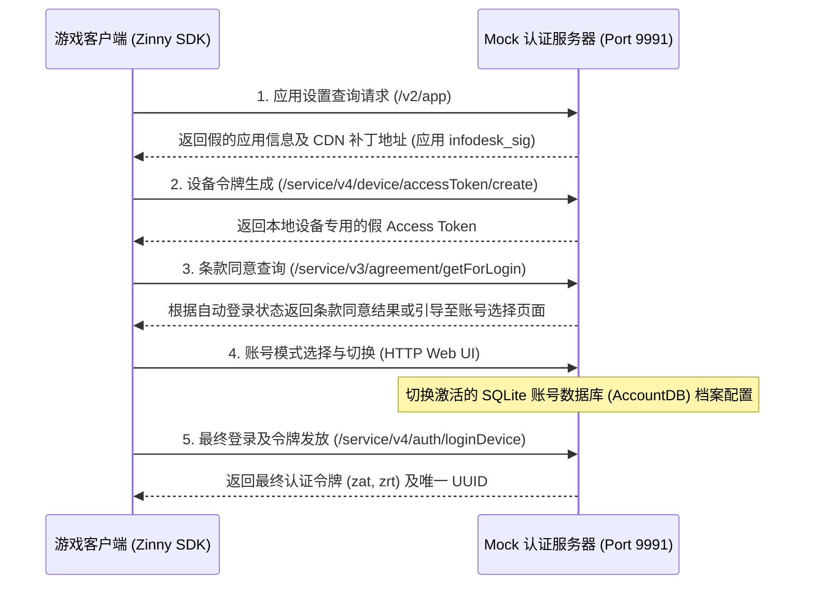

# 认证服务器功能说明书 (auth_server.md)

本文档详细介绍了永恒灵魂离线 PC 服务器的 Kakao/Zinny 认证服务器模拟实现。

---

## 1. 概述与通信流程
永恒灵魂客户端在运行游戏时，会使用 Kakao Games 的认证框架 (Zinny SDK) 进行玩家状态和安全验证。
由于离线环境无法访问外部认证基础设施，本项目在本地完全模拟了该过程，以确保游戏能够顺利通过运行阶段。

---

## 2. 核心 API 端点规范与模拟实现

### 2.4 Infodesk 完整性签名运算 (`infodesk_sig`)
*   **签名要求**: 若针对 CDN 服务器列表和应用设置响应的完整性签名头部 (`infodesk_sig` 或 `sig`) 不正确，Kakao SDK 将丢弃响应并中止运行。
*   **实际 C++ 实现 (`crypto.cpp`)**:
    *   在去混淆后的 10 个 Zinny infodesk 密钥中，使用第 0 个密钥 `"qvjNK+TlAJ"` 作为 HMAC-SHA256 的哈希密钥。
    *   以整个 JSON 响应体为目标执行 `hmac_sha256()` 运算，获取 32 字节的二进制摘要 (Digest)。
    *   利用 `base64_encode()` 将获取的摘要进行字符串编码后，加上标明密钥索引号的 `"0;"` 前缀，组装成最终签名值 (`"0;base64_hash..."`)，并通过 HTTP 响应头返回。

---

## 3. 账号会话持久化与注册表联动
*   **登录处理时的会话关联**:
    *   当收到 `/service/v4/auth/loginDevice` 及 `loginZinnyDevice` 请求时，`router.cpp` 中的 `mock_login_data_response()` 会生成假的 `zat` (Access Token) 及 `zrt` (Refresh Token) 令牌组。
    *   生成的令牌信息、登录时间戳、设备唯一 ID、`playerId` 等会被加载到 `AccountSessionRow` 结构体中。
    *   该结构体通过 `account_registry().upsert_session()` 记录到内存缓存和活动会话 DB (SQLite) 中，实现持久化。
*   **WebSocket 联动流程**:
    *   客户端完成登录后，若尝试连接实时 WebSocket 服务器端口 (Kakao Session RPC)，服务器将查询认证阶段保存的 `zat` 令牌值，以识别匹配的玩家会话。
    *   识别到会话后，基于 `ws_session_default_row()` 实时动态覆盖和修补会话数据，并立即作为 WebSocket 接收帧 (`initial_push`) 广播给客户端。
*   **账号档案切换 (基于 SQLite)**:
    *   用户选择的账号模式状态会反映在本地配置文件 (`ini` 存储) 的 `account_profile` 键中。
        *   `responses`: 保留了丰富养成角色状态的模式（通过加载 `account.db` 状态实现）。
        *   `responses_newbie`: 从新手教程开始的空白新账号模式。
    *   当路由器调用 `set_account_mode` 时，将更新 INI 配置并重置当前激活的 `AccountDB` 连接，从而以 100% 动态数据库状态切换取代旧版加载静态 JSON 封包的模式。

---

## 4. 源代码结构与设计规范

主导认证模拟处理的核心源文件组件及其内部函数规范。

### 4.1 相关源文件结构
*   **`src/server/app/router.cpp`**: 负责过滤客户端登录及认证通信路径，并绑定模拟响应的主体。
*   **`src/core/encoding/crypto.cpp`**: 直接实现 SHA-256、HMAC-SHA256、Base64 编码及 Kakao 签名密钥集运算的核心加密模块。
*   **`src/account/profile/account_registry.cpp`**: 在内存及数据库上创建玩家认证会话表 (`session`) 并管理 `zat`/`zrt` 映射状态的注册表。
*   **`src/config/ini/ini_store.cpp`**: 以线程安全的方式加载/更新绑定到 `eversoul.ini` 的账号模式配置及 CDN 路径选项的存储库。

### 4.2 主要核心函数设计
*   `HttpResponse route_request(uint64_t id, int fd, const HttpRequest &req)`:
    *   **作用**: 分析 TCP 会话中已解析请求对象 (`req.path`) 的地址，并将其传递给 `/service/v3/*` 及 `/service/v4/*` 相关的认证处理器。
*   `HttpResponse mock_login_data_response(uint64_t id, const std::string &label, const HttpRequest &req, bool is_first_login)`:
    *   **作用**: 精确验证请求体内的 `deviceId` 和 `playerId` 信息，生成包含假登录令牌信封 (`zat`, `zrt`) 结构的 JSON 格式响应体，并在 `account_registry` 中同步会话。
*   `std::string infodesk_sig(std::string_view body)`:
    *   **作用**: 推导并返回针对响应体的 hmac-sha256/base64 签名值，以便在查询 infodesk 时通过 Kakao SDK 内部库的验证过程。
*   `bool set_account_mode(AccountMode mode)`:
    *   **作用**: 将激活档案的账号模式 (`responses` 或 `responses_newbie`) 动态记录并保存到系统环境配置中。
