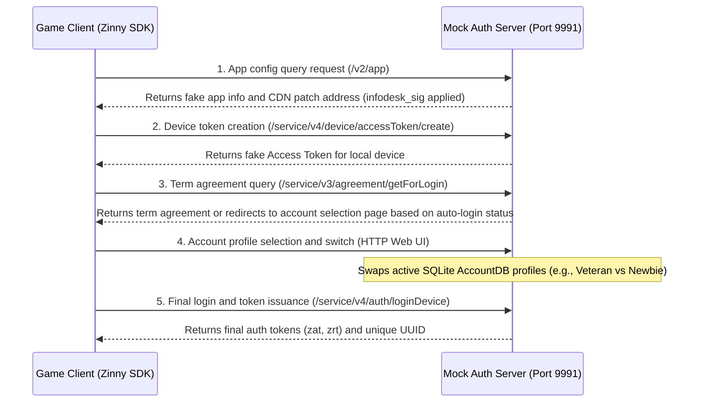

# Auth Server Feature Specification (auth_server.md)

This document details the mocking implementation of the Kakao/Zinny Auth Server for the Eversoul offline PC server.

---

## 1. Overview and Communication Flow
When running the game, the Eversoul client performs player state and security verification using Kakao Games' authentication framework (Zinny SDK). 
Since the offline environment cannot reach the external auth infrastructure, this project mocks this entirely locally to guarantee the game passes the execution phase.

---

## 2. Core API Endpoint Specification and Mocking Implementation

### 2.4 Infodesk Integrity Signature Operation (`infodesk_sig`)
*   **Signature Requirement**: The Kakao SDK discards the response and halts execution if the integrity signature header (`infodesk_sig` or `sig`) for the CDN server list and app config response is incorrect.
*   **Real C++ Implementation (`crypto.cpp`)**:
    *   Uses the 0th key, `"qvjNK+TlAJ"`, out of 10 de-obfuscated Zinny infodesk secret keys as the HMAC-SHA256 hash key.
    *   Executes the `hmac_sha256()` operation targeting the entire JSON response body to acquire a 32-byte binary digest.
    *   Encodes the acquired digest into a string using `base64_encode()`, appends the `"0;"` prefix indicating the key's index number, assembles the final signature value (`"0;base64_hash..."`), and returns it via the HTTP response header.

---

## 3. Account Session Persistence and Registry Integration
*   **Session Linkage During Login Processing**:
    *   When `/service/v4/auth/loginDevice` or `loginZinnyDevice` requests arrive, `mock_login_data_response()` in `router.cpp` generates fake `zat` (Access Token) and `zrt` (Refresh Token) sets.
    *   The generated token info, login timestamp, device unique ID, `playerId`, etc., are loaded into the `AccountSessionRow` struct.
    *   This struct is recorded and persisted into the memory cache and active session DB (SQLite) via `account_registry().upsert_session()`.
*   **WebSocket Integration Flow**:
    *   When the client attempts to connect to the real-time WebSocket server port (Kakao Session RPC) after login, the server retrieves the `zat` token saved during the auth phase to identify the matching player session.
    *   Once identified, the session data is dynamically overwritten and patched in real-time based on `ws_session_default_row()`, and immediately broadcasted to the client as a WebSocket receive frame (`initial_push`).
*   **Account Profile Switching (SQLite Based)**:
    *   The user's selected account mode status is reflected in the `account_profile` key in the local configuration file (`ini` store).
        *   `responses`: A mode preserving the rich state of a veteran character (via `account.db` state loading).
        *   `responses_newbie`: An empty new account mode starting from the tutorial.
    *   When the router calls `set_account_mode`, it updates the INI configuration and resets the active `AccountDB` connection, replacing the legacy static fixture loading with a 100% dynamic DB state switch.

---

## 4. Source Code Structure and Design Specification

The core source file components and internal function specifications driving the auth mocking processing.

### 4.1 Related Source File Structure
*   **`src/server/app/router.cpp`**: The main entity filtering client login/auth communication paths and binding mocking responses.
*   **`src/core/encoding/crypto.cpp`**: The core encryption module directly implementing SHA-256, HMAC-SHA256, Base64 encoding, and Kakao signature keyset operations.
*   **`src/account/profile/account_registry.cpp`**: A registry creating the player auth session table (`session`) on memory/DB and managing the `zat`/`zrt` mapping state.
*   **`src/config/ini/ini_store.cpp`**: A store safely loading/updating the account mode config and CDN path options bound to `eversoul.ini` in a thread-safe manner.

### 4.2 Major Core Function Design
*   `HttpResponse route_request(uint64_t id, int fd, const HttpRequest &req)`:
    *   **Role**: Analyzes the address of the parsed request object (`req.path`) in the TCP session and passes it to the relevant auth handlers for `/service/v3/*` and `/service/v4/*`.
*   `HttpResponse mock_login_data_response(uint64_t id, const std::string &label, const HttpRequest &req, bool is_first_login)`:
    *   **Role**: Accurately verifies `deviceId` and `playerId` within the request body, generates a JSON formatted body containing the fake login token envelope (`zat`, `zrt`) structure, and synchronizes the session in `account_registry`.
*   `std::string infodesk_sig(std::string_view body)`:
    *   **Role**: Derives and returns the hmac-sha256/base64 signature value for the body to pass the Kakao SDK internal library verification during infodesk queries.
*   `bool set_account_mode(AccountMode mode)`:
    *   **Role**: Dynamically records and preserves the active profile account mode (`responses` or `responses_newbie`) value to the system configuration.
