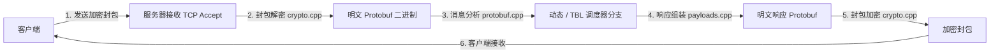

# 游戏服务器功能说明书 (game_server.md)

本文档详细介绍了永恒灵魂离线 PC 服务器核心的基于 Protocol Buffer (Protobuf) 的加解密处理以及 SQLite 数据库动态状态变异引擎。

---

## 1. 游戏协议及加解密层
永恒灵魂游戏客户端与主游戏服务器（默认端口：9991）之间通过对称密钥方式加密二进制 Protocol Buffer (Protobuf) 消息进行通信。

### 1.1 加解密及签名模块 (`crypto.cpp`)
*   **封包流向**: 与游戏客户端的二进制通信基于由 4 字节序列号和 4 字节负载大小头部包裹的字节流。
*   **加密操作与安全绕过**:
    *   `crypto.cpp` 模块执行实际游戏封包的对称 AES 解密。
    *   摆脱旧有的静态二进制封包重放模式，虚拟服务器现在严格遵守 **100% 动态路由** 的架构使命。它解密请求，查询 SQLite AccountDB，交叉验证 TBL 元数据，动态组装 Protobuf 负载，并在传输前重新加密。
    *   `crypto.cpp` 还负责 Kakao/Zinny SDK 认证所需的关键安全运算，计算 SHA-256、HMAC-SHA256、Base64 以及 infodesk 头部验证签名 (`infodesk_sig`)。
*   **安全绕过 (LIAPP 设备认证模拟)**: 在进入游戏前，移动端反作弊解决方案 LIAPP（Lockin Company）会强制调用设备认证 API（如 `/sbaa479o`）。在离线状态下无法访问该外部验证服务器，因此预先硬编码了固定的会话签名值（如 fdbd8509 系列）以返回完美的绕过响应。

### 1.2 Protobuf 报文处理 (`protobuf.cpp` 及 `payloads.cpp`)
*   **动态解析与打包**: 服务器结合使用动态反射技术 (`json_encoder.cpp`) 与二进制序列化辅助工具（`pb_int32`、`pb_string`、`pb_message` 等），直接在原始报文数据中记录并提取 Protobuf 消息标签（字段编号）。
*   **灵活性**: 即使在编译时没有静态绑定特定的 Protobuf 类，也可以在运行时灵活地提取请求字段值，并为模拟封包组装和注入字段。

---

## 2. 动态端点调度与状态变异结构

### 2.1 动态路由控制 (`dynamic_endpoint_dispatcher.cpp`)
*   涉及用户状态变更（消耗货币、英雄升级、关卡通关等）的核心 API 端点请求，若仅通过简单的静态 JSON 重放处理，将与客户端侧的模拟流程产生矛盾，导致游戏卡死或软锁定（例如由于 `__format__: empty` 数据污染引起）。
*   路由器 (`router.cpp`) 调用 `dispatch_dynamic_game_endpoint` 将这些请求分发给专用的动态处理服务。

### 2.2 持久化存储层 (SQLite ORM)
*   **数据库结构 (`account_database.cpp`, `storage.cpp`)**: 绑定轻量且强大的 C++ 库 `sqlite_orm` 来管理活跃账号数据。
*   **表结构规范**:
    *   `UserInfo`: 玩家等级、当前装备阵容、最近通关的剧情及关卡状态。
    *   `Currency`: 金币、水晶、召唤券、爱心等游戏货币的总量。
    *   `Hero`: 玩家所拥有英雄的唯一索引、等级、品阶 (Grade) 及超越属性。
    *   `Item`: 装备及消耗品道具数量。
    *   `Dungeon` & `Mail`: 进行中的地下城进度及邮箱信息。

### 2.3 UserInfo 动态组装流水线 (`userinfo_builder.cpp`)
*   **重构机制**:
    *   当客户端请求账号档案状态信息 (`/UserInfo`) 时，服务器将对应的协议定义文件 (`schema/UserInfo.json`) 解析加载到内存中。
    *   随后，从 SQLite 数据库中查询真实的玩家数据（`heroes()`, `currencies()`, `item_etcs()`, `stages()`, `tutorials()` 等），并实时动态构建 JSON 树结构（`user`, `currency`, `hero`, `stage`, `formation` 等），彻底摒弃对静态 `responses/UserInfo.json` 的依赖。
    *   将动态构建好的 JSON 对象发送给 `json_encoder.cpp` 的动态反射器，将其精密编码为二进制格式的 Protobuf 数据，从而返回完美的动态响应。
*   **核心状态变异服务实现 (`endpoint_mutation_service.cpp`)**:
    *   **关卡/剧情通关 (`StageClear`, `StoryClear`)**:
        *   从请求封包中提取通关的关卡编号，并记录更新到数据库的 `UserInfo` 中。
        *   同步相应的关卡首通奖励及放置自动战斗解锁规则，从根本上防止卡死（如 1-2 无限循环错误）现象。
    *   **英雄召唤 (`GachaHero`, `GachaPremium`)**:
        *   在账号货币表中扣除消耗的资源（水晶等）。
        *   对照 `tbl_heroes.json` 元数据生成有效的角色索引，并插入到已拥有英雄表中。
        *   将累计里程碑反映到数据库，并返回更新后的召唤结果。
    *   **商店及道具消耗 (`ShopItemBuy`, `ItemUse`)**:
        *   参考商店商品目录信息 (`game_catalog.cpp`) 扣除商品花费，并在玩家背包中增加相应道具数量。
        *   使用背包内道具时，正常扣除该数量，并将内部获得的产物持久化同步至用户档案状态中。
    *   **货币同步钩子**: 当发生动态数据库变更时，将执行后台线程函数 (`sync_db_currencies_to_fixture`)，确保数据一致性始终保持在 100%。

---

## 3. 源代码类与函数设计规范

负责游戏协议处理及 SQLite 持久化数据处理的核心模块设计结构。

### 3.1 加密及报文解析器设计
*   **签名运算 (`src/core/encoding/crypto.cpp`)**:
    *   `std::string infodesk_sig(std::string_view body)`: 利用从 JSON infodesk 规范中解密的特殊密钥 `"qvjNK+TlAJ"` 计算 HMAC-SHA256 哈希值，经 Base64 编码后传至头部。
*   **Protobuf 分析 (`src/game/protocol/protobuf.cpp`)**:
    *   `int32_t pb_get_int32(const std::string &buffer, int field_number, int fallback)`: 从序列化后的 Protobuf 明文流中追踪目标字段标签编号，直接解析并返回整型数据。
    *   `std::string pb_get_string(const std::string &buffer, int field_number, const std::string &fallback)`: 从报文中读取字符串字段，经过一致性验证后安全地转换为字符串。

### 3.2 动态状态控制及变异服务设计
*   **动态调度器 (`src/game/endpoints/dynamic_endpoint_dispatcher.cpp`)**:
    *   `std::optional<HttpResponse> dispatch_dynamic_game_endpoint(uint64_t id, const HttpRequest &req, void(*sync_hook)())`:
        *   **作用**: 分析传入的游戏请求封包的头部地址，若属于 `/GachaHero`, `/StageClear`, `/ItemUse` 等必须进行持久化更改的路径，则执行数据库事务函数并返回最终结果封包。
*   **UserInfo 构建器 (`src/orm/userinfo_builder.cpp`)**:
    *   `std::string build_user_info_payload(const std::string &data_dir)`:
        *   **作用**: 在请求 `/UserInfo` 数据时，基于激活档案动态更新 SQLite 持久化状态，经过反射转换后生成 Protobuf 负载。
*   **变异引擎 (`src/game/endpoints/endpoint_mutation_service.cpp`)**:
    *   `std::string db::stage_clear(int32_t stage_no)`:
        *   **作用**: 将客户端最新的关卡进度记录到持久化数据库的 UserInfo 表中，并生成反映该进度对应的放置狩猎奖励比例提升及抽卡解锁状态的序列化响应负载。
    *   `std::string db::gacha_hero(int32_t gacha_id, int32_t count)`:
        *   **作用**: 参考玩家的英雄模板及品阶数据，根据召唤概率分布插入新获得的角色结构，处理里程碑等级状态的累加后返回。
*   **SQLite 存储库及 Schema 映射 (`src/orm/schema.hpp` 及 `storage.cpp`)**:
    *   利用 `sqlite_orm` 模板声明，将 C++ 结构体（UserInfo, Hero, Item 等）与本地关系型数据库表结构进行 1:1 映射以构成逻辑。
    *   `bool ensure_ready(const std::string &data_dir)`: 在虚拟服务器运行及模式变更时，保证该账号的 SQLite 数据库 Schema 完整性，并确保初始化过程顺利完成。
