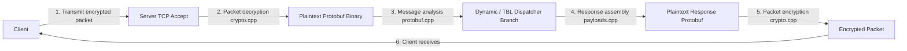

# Game Server Feature Specification (game_server.md)

This document details the core Protobuf-based encryption/decryption processing and the SQLite database dynamic state mutation engine, representing the heart of the Eversoul offline PC server.

---

## 1. Game Protocol and Encryption Layer
The Eversoul game client and main game server (default port: 9991) communicate by encrypting binary Protocol Buffer (Protobuf) messages using symmetric keys.

### 1.1 Encryption/Decryption and Signature Module (`crypto.cpp`)
*   **Packet Flow**: Binary communication with the game client relies on a byte stream wrapped with a 4-byte sequence number and a 4-byte payload size header.
*   **Cryptographic Operations and Security Bypassing**:
    *   The `crypto.cpp` module performs symmetric AES decryption of the game packet itself.
    *   Moving away from legacy static binary fixture replays, the virtual server now strictly adheres to a **100% Dynamic Routing** mandate. It decrypts the request, queries the SQLite AccountDB, cross-references TBL metadata, dynamically assembles the Protobuf payload, and encrypts it back before transmission.
    *   `crypto.cpp` is also responsible for security operations required for Kakao/Zinny SDK authentication, computing SHA-256, HMAC-SHA256, Base64, and the infodesk header verification signature (`infodesk_sig`).
*   **Security Bypass (LIAPP Device Auth Mocking)**: Right before game entry, the mobile anti-cheat solution LIAPP (Lockin Company) forces a device authentication API call (e.g., `/sbaa479o`). Since the offline environment cannot reach this external verification server, a fixed session signature value (e.g., fdbd8509 series) is hardcoded to return a perfect bypass response.

### 1.2 Protobuf Wire Processing (`protobuf.cpp` and `payloads.cpp`)
*   **Dynamic Parsing and Packaging**: The server combines dynamic reflection techniques (`json_encoder.cpp`) and binary serialization helpers (`pb_int32`, `pb_string`, `pb_message`, etc.) that directly record and extract Protobuf message tags (field numbers) from raw wire data.
*   **Flexibility**: Even without specific Protobuf classes statically bound at compile time, it can flexibly extract request field values and assemble/inject fields for the mock packet at runtime.

---

## 2. Dynamic Endpoint Dispatching and State Mutation Structure

### 2.1 Dynamic Routing Control (`dynamic_endpoint_dispatcher.cpp`)
*   Core API endpoint requests involving user state changes (currency consumption, hero leveling, stage clears) cause contradictions with the client's simulation flow if handled by simple static JSON replays, leading to game freezes or soft-locks (e.g., due to `__format__: empty` data corruption).
*   The router (`router.cpp`) calls `dispatch_dynamic_game_endpoint` to branch these into dedicated services for dynamic processing.

### 2.2 Persistence Storage Layer (SQLite ORM)
*   **Database Structure (`account_database.cpp`, `storage.cpp`)**: Binds the lightweight yet powerful C++ library `sqlite_orm` to manage active account data.
*   **Table Specifications**:
    *   `UserInfo`: Player level, current equipped formation, recently cleared story and stage states.
    *   `Currency`: Totals of game currencies like gold, crystals, summon tickets, hearts.
    *   `Hero`: Unique indices, levels, grades, and transcend stats of heroes owned by the player.
    *   `Item`: Counts of equipment and consumable items.
    *   `Dungeon` & `Mail`: Ongoing dungeon progress and mailbox information.

### 2.3 UserInfo Dynamic Assembly Pipeline (`userinfo_builder.cpp`)
*   **Reconstruction Mechanism**:
    *   When the client requests account profile state information (`/UserInfo`), the server reads the corresponding protocol definition file (`schema/UserInfo.json`) into memory.
    *   It then retrieves actual user data (`heroes()`, `currencies()`, `item_etcs()`, `stages()`, `tutorials()`, etc.) from the SQLite database and dynamically constructs the JSON tree structure (`user`, `currency`, `hero`, `stage`, `formation`, etc.) in real-time, abandoning reliance on static `responses/UserInfo.json`.
    *   The dynamically built JSON object is passed to the dynamic reflector in `json_encoder.cpp` to precisely encode it into the binary Protobuf format, returning a perfect dynamic response.
*   **Core State Mutation Service Implementation (`endpoint_mutation_service.cpp`)**:
    *   **Stage/Story Clear (`StageClear`, `StoryClear`)**:
        *   Extracts the cleared stage number from the request packet and records it in the `UserInfo` database.
        *   Synchronizes corresponding first-clear rewards and idle auto-hunt unlock rules to fundamentally prevent soft-locks (e.g., 1-2 infinite loop errors).
    *   **Hero Summon (`GachaHero`, `GachaPremium`)**:
        *   Deducts consumed currency (crystals, etc.) from the account currency table.
        *   Cross-references `tbl_heroes.json` metadata to generate a valid character index and inserts it into the owned heroes table.
        *   Reflects accumulated mileage in the database and returns the updated summon result.
    *   **Shop and Item Consumption (`ShopItemBuy`, `ItemUse`)**:
        *   References shop catalog info (`game_catalog.cpp`) to deduct item costs and adds the item count to the player's inventory.
        *   When using items from the bag, deducts the normal quantity and persistently synchronizes the internal acquired results to the user profile state.
    *   **Currency Sync Hook**: When a dynamic database change occurs, a background thread function (`sync_db_currencies_to_fixture`) ensures data integrity remains 100% consistent across the system.

---

## 3. Source Code Class and Function Design Specifications

The core module design structure responsible for game protocol processing and SQLite persistent data handling.

### 3.1 Encryption and Wire Parser Design
*   **Signature Operation (`src/core/encoding/crypto.cpp`)**:
    *   `std::string infodesk_sig(std::string_view body)`: Calculates an HMAC-SHA256 hash with the special key `"qvjNK+TlAJ"` deciphered from the JSON infodesk specification, encodes it in Base64, and passes it to the header.
*   **Protobuf Analysis (`src/game/protocol/protobuf.cpp`)**:
    *   `int32_t pb_get_int32(const std::string &buffer, int field_number, int fallback)`: Tracks the target field tag number from the serialized Protobuf plaintext stream to parse and return integer data directly.
    *   `std::string pb_get_string(const std::string &buffer, int field_number, const std::string &fallback)`: Reads a string field from the wire, performs integrity validation, and safely converts it to a string.

### 3.2 Dynamic State Control and Mutation Service Design
*   **Dynamic Dispatcher (`src/game/endpoints/dynamic_endpoint_dispatcher.cpp`)**:
    *   `std::optional<HttpResponse> dispatch_dynamic_game_endpoint(uint64_t id, const HttpRequest &req, void(*sync_hook)())`:
        *   **Role**: Analyzes the header address of incoming game request packets. If it is a route requiring persistent changes (e.g., `/GachaHero`, `/StageClear`, `/ItemUse`), it executes the database transaction function and returns the final result packet.
*   **UserInfo Builder (`src/orm/userinfo_builder.cpp`)**:
    *   `std::string build_user_info_payload(const std::string &data_dir)`:
        *   **Role**: Dynamically builds the SQLite persistent state based on the active profile upon a `/UserInfo` data request, passing it through reflection transformation to generate the Protobuf payload.
*   **Mutation Engine (`src/game/endpoints/endpoint_mutation_service.cpp`)**:
    *   `std::string db::stage_clear(int32_t stage_no)`:
        *   **Role**: Records the client's latest stage progress in the persistent database's UserInfo table, and generates a serialized response payload reflecting idle hunt reward rate increases and gacha unlock status according to that progress.
    *   `std::string db::gacha_hero(int32_t gacha_id, int32_t count)`:
        *   **Role**: Inserts new owned character structures and adds to the mileage grade status based on summon probability distributions, referring to the player's hero template and grade data.
*   **SQLite Repository and Schema Mapping (`src/orm/schema.hpp` and `storage.cpp`)**:
    *   Constructs logic by mapping C++ structs (UserInfo, Hero, Item, etc.) 1:1 with local relational database table structures utilizing `sqlite_orm` template declarations.
    *   `bool ensure_ready(const std::string &data_dir)`: Guarantees the initialization process and ensures the integrity of the SQLite database schema for that account when starting the virtual server or changing modes.
