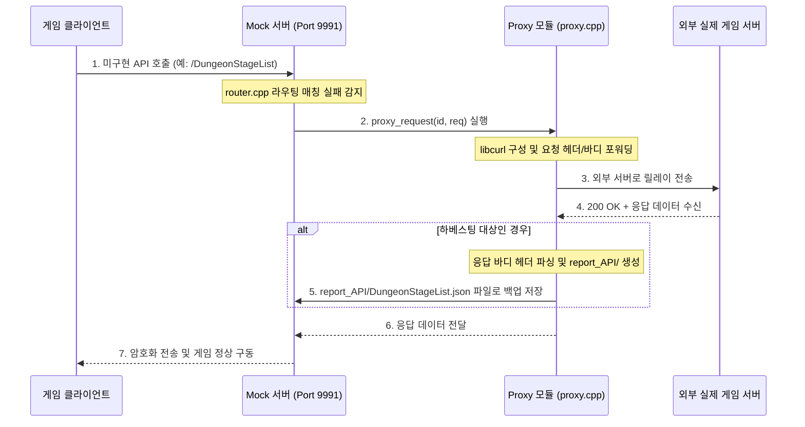

# 프록시 서버 기능 명세서 (proxy_server.md)

이 문서는 에버소울 오프라인 PC 서버의 리버스 프록시(Reverse Proxy) 작동 아키텍처와 API 하베스팅(Harvesting, 패킷 수집) 메커니즘을 상세히 기술합니다.

---

## 1. 프록시 설계 의도 및 역할
로컬 피스처(Fixture) 데이터베이스에 존재하지 않거나, 아직 서버 측 구현이 완료되지 않은 새로운 게임의 기능 경로가 실행될 때 서버가 통신 오류를 내며 중단되는 것을 방지하기 위하여 **리버스 프록시 모드**를 지원합니다.
*   **통신 릴레이**: 클라이언트의 오프라인 서버 요청 중 로컬 모킹 규칙에 정의되지 않은 경로를 감지하면, 이를 외부의 실제 에버소울 상용 서버(`config().game_server_url`)로 투명하게 전달합니다.
*   **패킷 하베스팅**: 통신을 전달하고 반환받은 원격 서버의 바이너리 또는 JSON 데이터를 가로채 로컬 디스크에 자동으로 파일로 기록하여 개발자가 향후 손쉽게 정적/동적 피스처로 이식할 수 있도록 돕습니다.

---

## 2. 프록시 통신 아키텍처 및 내부 로직

### 2.1 CURL 기반 요청 포워딩 및 경로 분기 (`proxy.cpp`)
*   **지능형 업스트림 라우팅 (`upstream_for_path`)**:
    *   프록시 모킹은 요청 경로의 패턴에 따라 타겟 Kakao 상용 서버 도메인을 동적으로 전환합니다.
    *   `/v2/`로 시작하는 경로(예: 앱 약관, 로그인 등 인포데스크 관련)의 경우 `https://gc-infodesk-zinny3.kakaogames.com` 업스트림으로 분기합니다.
    *   그 외의 게임 로비 트랜잭션 관련 경로들은 `https://gc-openapi-zinny3.kakaogames.com` 업스트림으로 자동 라우팅하여 요청을 포워딩합니다.
*   **헤더 및 컨텍스트 유지**: 클라이언트 요청의 원본 HTTP 헤더(예: `Content-Type`, 암호화 토큰, `zat` 서명 등)를 그대로 복사하여 외부 실제 게임 서버로 발송함으로써 요청의 유효성을 통과시킵니다.

### 2.2 API 하베스팅 프로세스
*   **8바이트 헤더 제외 및 직렬화**: 
    *   프록시 통신이 성공(200 OK)하면, `router.cpp`에서 응답 바디의 맨 앞 **8바이트**(4바이트 시퀀스 번호 + 4바이트 페이로드 크기로 구성된 프로토콜 봉투 헤더)를 떼어내고(`resp.body.substr(8)`) 순수 Protobuf 바이너리 페이로드 데이터만 추출합니다.
*   **기록 경로 및 덮어쓰기 정책**:
    *   추출된 평문 데이터는 `report_API/엔드포인트명.json` (예: `report_API/OriginTowerList.json`) 파일로 기록됩니다.
    *   성능 및 중복 기록 방지를 위해 이미 파일이 존재하는 경우 덮어쓰지 않으나, 영속성 추적이 필요한 계정 상태 변이 API(`is_stateful_endpoint()`가 참인 경로)이거나 아예 신규 파일인 경우에만 강제로 파일을 새로 저장하도록 세부 정책이 구현되어 있습니다.

---

## 3. 프록시 모드 활성화 및 구성법
*   서버 실행 시 옵션 `--proxy` 매개변수가 감지되거나, 로컬 설정 파일 `ba.ini` 또는 웹 관리 UI의 설정 변경 API(`POST /web/api/config`)를 호출하여 프록시 구동 여부를 변경할 수 있습니다.
*   프록시가 동작하는 순간, 서버의 디버그 콘솔과 로깅 파일(`har_log.cpp`)에 `[HARVEST]` 또는 `[CDN]` 등과 같은 분류 태그가 로깅되어 분석 효율성을 크게 향상시킵니다.

---

## 4. 소스 코드 클래스 및 함수 설계 명세

외부 게임 서버와의 중계 통신 및 수집 저장을 관리하는 핵심 소스 코드 설계 구조입니다.

### 4.1 관련 소스 파일 구성
*   **`src/network/proxy/proxy.cpp`**: `libcurl`과 연동하여 소켓 입력을 외부 서버로 재발송하고 경로별 업스트림 도메인 매핑(`upstream_for_path`)을 제공하는 코어 파일.
*   **`src/server/app/router.cpp` (프록시 폴백 구문)**: 라우터 최하단에서 로컬 피스처 매칭 실패 시 프록시 호출을 수행하고 8바이트 헤더를 제거한 바디를 `report_API/`로 저장하는 라우팅 분기 처리.

### 4.2 주요 핵심 함수 설계
*   `std::string upstream_for_path(const std::string &path)`:
    *   **역할**: 경로 접두사가 `/v2/`인지 판별하여 인포데스크 도메인과 OpenAPI 도메인 중 적절한 외부 카카오 업스트림 주소를 도출해냅니다.
*   `HttpResponse proxy_request(uint64_t id, const HttpRequest &req)`:
    *   **역할**: 들어온 로컬 요청 객체(`req`)를 검사하여 `CURL` 세션을 생성하고, 타겟 호스트 도메인을 실제 상용 서버 주소로 변경하여 포워딩을 수행합니다.
*   `bool write_data_file(std::string rel_path, const std::string &content)`:
    *   **역할**: 수집된 응답 평문 페이로드를 디렉터리 경로를 자동 생성하면서 파일로 기록합니다. 프록시 모드가 활성화된 경우 `report_API/` 폴더 내에 안전하게 영속 디스크 아카이브합니다.

