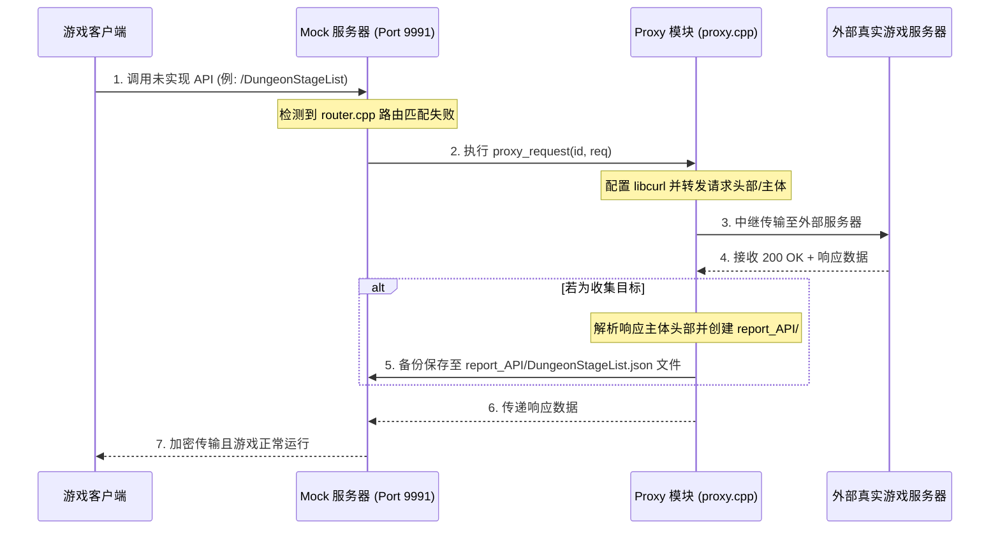

# 代理服务器功能说明书 (proxy_server.md)

本文档详细介绍了永恒灵魂离线 PC 服务器的反向代理 (Reverse Proxy) 运行架构与 API 数据收集 (Harvesting，即封包抓取) 机制。

---

## 1. 代理设计意图与作用
当执行本地 SQLite/TBL 数据库中不存在，或服务器端尚未实现的新游戏功能路径时，为防止服务器发生通信错误而中断，支持**反向代理模式**。
*   **通信中继**: 在客户端的离线服务器请求中，若检测到未在本地模拟规则中定义的路径，则将其透明地转发至外部真实的永恒灵魂商用服务器 (`config().game_server_url`)。
*   **封包收集 (Harvesting)**: 拦截转发通信后从远程服务器返回的二进制或 JSON 数据，并自动将其作为文件记录在本地磁盘上，从而帮助开发者在未来轻松地将其移植到基于 SQLite DB 的动态路由 Schema (Dynamic Routing Schema) 中。

---

## 2. 代理通信架构与内部逻辑

### 2.1 基于 CURL 的请求转发与路径分支 (`proxy.cpp`)
*   **智能上游路由 (`upstream_for_path`)**:
    *   代理模拟会根据请求路径的模式动态切换目标 Kakao 商用服务器域名。
    *   对于以 `/v2/` 开头的路径（例如应用条款、登录等与 infodesk 相关的路径），将分支至 `https://gc-infodesk-zinny3.kakaogames.com` 上游。
    *   对于其他与游戏大厅事务相关的路径，则自动路由并转发请求至 `https://gc-openapi-zinny3.kakaogames.com` 上游。
*   **保持头部与上下文**: 原样复制客户端请求的原始 HTTP 头部（如 `Content-Type`、加密令牌、`zat` 签名等），并发送至外部真实游戏服务器，从而通过请求的有效性验证。

### 2.2 API 数据收集流程
*   **排除 8 字节头部与序列化**: 
    *   若代理通信成功 (200 OK)，`router.cpp` 会剥离响应主体最前面的 **8 字节**（由 4 字节序列号 + 4 字节负载大小组成的协议信封头部，`resp.body.substr(8)`），仅提取纯 Protobuf 二进制负载数据。
*   **记录路径与覆盖策略**:
    *   提取的明文数据将被记录为 `report_API/端点名称.json` (例如: `report_API/OriginTowerList.json`) 文件。
    *   为保证性能及防止重复记录，如果文件已存在则不进行覆盖。但实现了详细策略，只有在需要持久性追踪的账号状态变异 API（`is_stateful_endpoint()` 为真的路径）或是全新的文件时，才会强制重新保存文件。

---

## 3. 代理模式激活与配置方法
*   在启动服务器时检测到 `--proxy` 参数选项，或通过调用本地配置文件 `ba.ini` 或 Web 管理 UI 的设置更改 API (`POST /web/api/config`)，即可更改代理是否运行。
*   代理运行的瞬间，服务器的调试控制台和日志文件 (`har_log.cpp`) 中会记录如 `[HARVEST]` 或 `[CDN]` 等分类标签，极大提高了分析效率。

---

## 4. 源代码类与函数设计规范

管理与外部游戏服务器的中继通信及收集保存的核心源代码设计结构。

### 4.1 相关源文件结构
*   **`src/network/proxy/proxy.cpp`**: 与 `libcurl` 联动，将套接字输入重新发送至外部服务器，并提供按路径映射上游域名 (`upstream_for_path`) 的核心文件。
*   **`src/server/app/router.cpp` (代理后备语句)**: 在路由器最底部，当本地封包匹配失败时执行代理调用，并将剥离了 8 字节头部的响应主体保存至 `report_API/` 的路由分支处理。

### 4.2 主要核心函数设计
*   `std::string upstream_for_path(const std::string &path)`:
    *   **作用**: 判断路径前缀是否为 `/v2/`，从而在 infodesk 域名和 OpenAPI 域名中推导出合适的外部 Kakao 上游地址。
*   `HttpResponse proxy_request(uint64_t id, const HttpRequest &req)`:
    *   **作用**: 检查传入的本地请求对象 (`req`)，创建 `CURL` 会话，将目标主机域名更改为实际商用服务器地址并执行转发。
*   `bool write_data_file(std::string rel_path, const std::string &content)`:
    *   **作用**: 自动创建目录路径，并将收集到的响应明文负载记录为文件。在代理模式激活的情况下，将其安全地持久化归档到磁盘的 `report_API/` 文件夹中。
