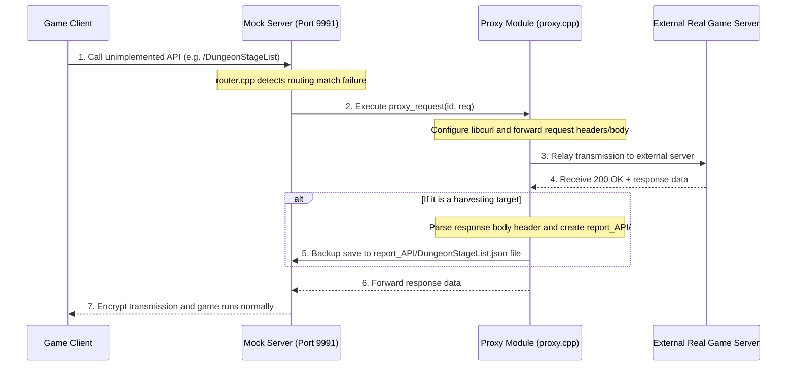

# Proxy Server Feature Specification (proxy_server.md)

This document details the reverse proxy operating architecture and the API harvesting (packet collection) mechanism of the Eversoul offline PC server.

---

## 1. Proxy Design Intent and Role
To prevent the server from crashing with communication errors when a new game feature path—that does not exist in the local SQLite/TBL database or has not yet been implemented server-side—is executed, it supports a **Reverse Proxy Mode**.
*   **Communication Relay**: If it detects a path among the client's offline server requests that is not defined in the local mocking rules, it transparently forwards it to the external real Eversoul live server (`config().game_server_url`).
*   **Packet Harvesting**: It intercepts the binary or JSON data returned by the remote server after forwarding the communication and automatically records it as a file on the local disk. This helps developers easily port it to the SQLite DB-based dynamic routing schema in the future.

---

## 2. Proxy Communication Architecture and Internal Logic

### 2.1 CURL-Based Request Forwarding and Path Branching (`proxy.cpp`)
*   **Intelligent Upstream Routing (`upstream_for_path`)**:
    *   Proxy mocking dynamically switches the target Kakao live server domain based on the pattern of the request path.
    *   For paths starting with `/v2/` (e.g., infodesk-related like app terms, login, etc.), it branches to the `https://gc-infodesk-zinny3.kakaogames.com` upstream.
    *   For other game lobby transaction-related paths, it automatically routes and forwards the request to the `https://gc-openapi-zinny3.kakaogames.com` upstream.
*   **Header and Context Preservation**: It copies the original HTTP headers of the client request (e.g., `Content-Type`, encryption tokens, `zat` signature, etc.) exactly as they are and sends them to the external real game server, thereby passing the request's validity check.

### 2.2 API Harvesting Process
*   **8-Byte Header Exclusion and Serialization**: 
    *   If the proxy communication is successful (200 OK), `router.cpp` detaches the first **8 bytes** (a protocol envelope header consisting of a 4-byte sequence number + 4-byte payload size) of the response body (`resp.body.substr(8)`) and extracts only the pure Protobuf binary payload data.
*   **Recording Path and Overwrite Policy**:
    *   The extracted plaintext data is recorded in the `report_API/endpoint_name.json` (e.g., `report_API/OriginTowerList.json`) file.
    *   To prevent duplicate recording and ensure performance, it does not overwrite if the file already exists. However, detailed policies are implemented to force a new file save only if it's an account state mutation API requiring persistence tracking (paths where `is_stateful_endpoint()` is true) or if the file does not exist at all.

---

## 3. Proxy Mode Activation and Configuration
*   You can change whether the proxy runs by detecting the `--proxy` parameter option when starting the server, or by calling the local configuration file `ba.ini` or the setting change API (`POST /web/api/config`) of the web admin UI.
*   The moment the proxy operates, classification tags like `[HARVEST]` or `[CDN]` are logged in the server's debug console and logging file (`har_log.cpp`), greatly improving analysis efficiency.

---

## 4. Source Code Class and Function Design Specifications

The core source code design structure managing relay communication with external game servers and collection storage.

### 4.1 Related Source File Structure
*   **`src/network/proxy/proxy.cpp`**: The core file that integrates with `libcurl` to resend socket inputs to external servers and provides upstream domain mapping per path (`upstream_for_path`).
*   **`src/server/app/router.cpp` (Proxy Fallback Syntax)**: The routing branch processing at the very bottom of the router that executes a proxy call upon local fixture match failure and saves the body with the 8-byte header removed to `report_API/`.

### 4.2 Major Core Function Design
*   `std::string upstream_for_path(const std::string &path)`:
    *   **Role**: Determines whether the path prefix is `/v2/` to derive the appropriate external Kakao upstream address between the infodesk domain and the OpenAPI domain.
*   `HttpResponse proxy_request(uint64_t id, const HttpRequest &req)`:
    *   **Role**: Inspects the incoming local request object (`req`), creates a `CURL` session, changes the target host domain to the actual live server address, and performs forwarding.
*   `bool write_data_file(std::string rel_path, const std::string &content)`:
    *   **Role**: Automatically creates the directory path and records the collected response plaintext payload as a file. When proxy mode is active, it safely archives it on a persistent disk within the `report_API/` folder.
