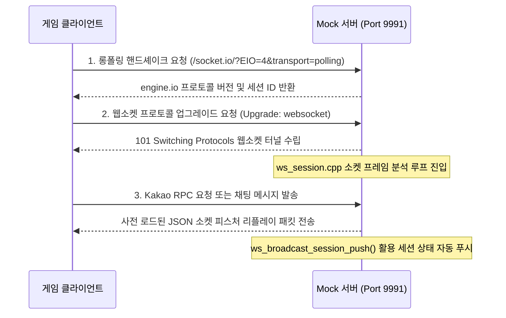

# 웹소켓 서버 기능 명세서 (websocket_server.md)

이 문서는 에버소울 오프라인 PC 서버의 웹소켓(WebSocket) 및 실시간 채팅(socket.io) 리플레이 기능에 대하여 상세히 기술합니다.

---

## 1. 실시간 통신 및 소켓 모킹의 의도
에버소울 게임 내에는 플레이어 간의 실시간 메시지 전송, 친구 활동 동기화, 카카오 계정 세션의 실시간 상태 전송을 위한 백그라운드 웹소켓 채널이 존재합니다. 
오프라인 환경에서도 클라이언트가 소켓 서버와의 핸드셰이크에 실패하여 네트워크 중단 경고창을 띄우지 않도록 하기 위하여 **실시간 웹소켓 서버**를 모킹하여 동작시킵니다.

---

## 2. 웹소켓 라이프사이클 및 핸들링 메커니즘

### 2.1 HTTP 롱폴링 핸드셰이크 및 업그레이드
*   **롱폴링 부트스트랩**: 클라이언트는 최초 웹소켓 연결 전에 `socket.io`(실제로는 engine.io 와이어 스키마)의 폴링 전송 경로(`/socket.io/`)로 일반 HTTP 요청을 먼저 시도합니다.
*   **업그레이드 확인**: 요청의 HTTP 헤더 중 `Connection: upgrade` 및 `Upgrade: websocket`이 확인되면, `is_websocket_upgrade(req)` 판단 하에 클라이언트 연결 세션을 전용 소켓 프레임 핸들러(`handle_websocket`)로 즉시 인계합니다.

### 2.2 웹소켓 세션 프레임 파싱 (`websocket.cpp` 및 `ws_session.cpp`)
*   **프레임 복호화**: 로우 레벨의 웹소켓 프로토콜 마스크(Mask) 키 복호화와 핀(FIN), 옵코드(Opcode) 처리를 담당하는 단일 스레드 기반 무한 수신 루프가 실행됩니다.
*   **카카오 JSON-RPC Replay**: 게임 로그인 완료 후 세션 지속성 검증을 위해 오가는 카카오 인증 RPC 메시지 패킷에 대하여 사전에 녹화된 JSON-RPC 가짜 응답 데이터를 검색하고 바인딩하여 재전송해 줍니다.
*   **채팅(socket.io) Replay**: 게임 내 로비 채팅 또는 길드 통신 포트를 가상으로 수립하여 가짜 채팅 메시지 배열 리스트를 발송해 주어 대화창 오류가 뜨지 않게 제어합니다.

---

## 3. 세션 푸시 통신 기능 (`ws_broadcast_session_push`)
*   웹 UI 관리 화면(`/web/`) 등을 통해 사용자가 로컬 기기에서 플레이 중인 유저의 닉네임, 골드 잔액, 영웅 등급 등을 실시간으로 수정하는 경우, 소켓 통신을 통해 클라이언트에 강제 갱신 푸시를 보내야 합니다.
*   `ws_broadcast_session_push()` 헬퍼 함수가 트리거되면 현재 활성화되어 열려 있는 모든 게임 소켓 세션 연결들에 변경된 계정의 동기화 상태 메시지를 소켓 브로드캐스팅(Push)하여, 클라이언트가 게임을 재부팅하지 않고도 재화 및 영웅이 UI 상에서 즉시 반영되는 환경을 구축합니다.

---

## 4. 소스 코드 클래스 및 함수 설계 명세

실시간 세션 및 채팅 메시지 리플레이를 처리하는 소스 파일 구성과 함수 설계입니다.

### 4.1 관련 소스 파일 구성
*   **`src/network/websocket/websocket.cpp`**: 로우 레벨 웹소켓 마스크 해제, 프레임 송수신 바디 파싱 및 기본 핑/퐁 제어.
*   **`src/network/websocket/ws_session.cpp`**: 카카오 세션 동기화, 실시간 세션 클라이언트 리스트 유지 및 채팅 리플레이 페이로드 보관.

### 4.2 주요 핵심 함수 설계
*   `bool is_websocket_upgrade(const HttpRequest &req)`:
    *   **역할**: 들어온 HTTP 요청 헤더에서 `Upgrade: websocket` 규격을 조사하여 진위 여부를 판별합니다.
*   `void handle_websocket(uint64_t id, int fd, const HttpRequest &req, const std::string &initial_body)`:
    *   **역할**: 웹소켓 핸드셰이크 응답 헤더(`Sec-WebSocket-Accept`)를 생성하여 전송하고, 소켓 주도권을 넘겨받아 프레임 분석 무한 루프(`ws_session_loop`)를 스레드로 구동합니다.
*   `void ws_broadcast_session_push()`:
    *   **역할**: 활성화되어 있는 가상 세션 리스트(`g_ws_sessions`)를 순회하며, 현재 유저 프로필 상태가 담긴 최신의 동기화 메시지를 직렬화하여 강제 발송합니다.
*   `bool socketio_poll_response(const std::string &method, const std::string &query, std::string &out_body)`:
    *   **역할**: 웹소켓 연결 전에 동작하는 엔진아이오(`engine.io`) 폴링 통신 규격에 맞추어 세션 생성 JSON 봉투를 조립하여 회신합니다.

