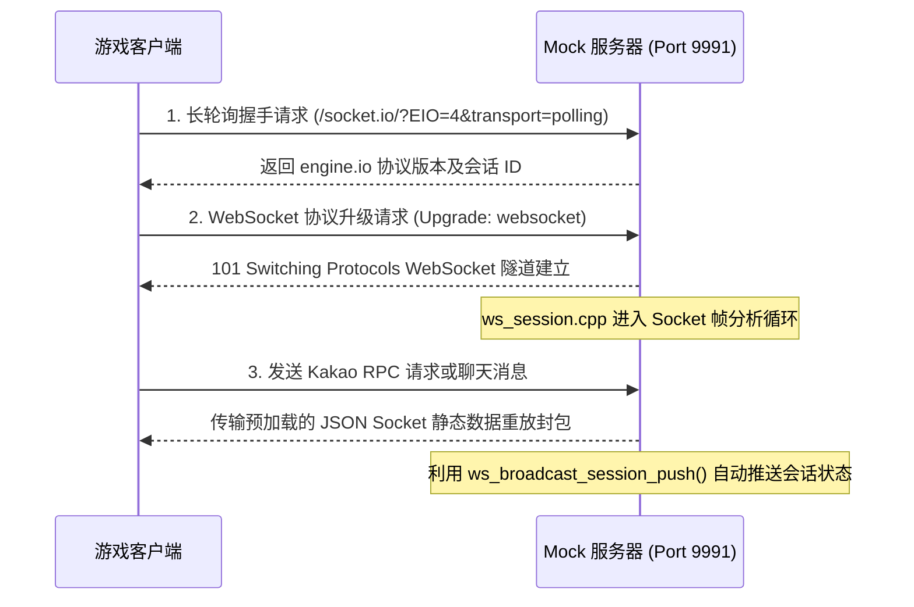

# WebSocket 服务器功能说明书 (websocket_server.md)

本文档详细介绍了永恒灵魂离线 PC 服务器的 WebSocket 以及实时聊天 (socket.io) 重放 (Replay) 功能。

---

## 1. 实时通信与 Socket 模拟意图
永恒灵魂游戏内存在一个后台 WebSocket 通道，用于玩家间的实时消息传输、好友活动同步以及 Kakao 账号会话的实时状态传输。
为了在离线环境中避免客户端因与 Socket 服务器握手失败而弹出网络中断警告窗口，我们模拟并运行了**实时 WebSocket 服务器**。

---

## 2. WebSocket 生命周期与处理机制

### 2.1 HTTP 长轮询握手及升级
*   **长轮询引导 (Bootstrap)**: 客户端在首次建立 WebSocket 连接之前，会先向 `socket.io` (实际上是 engine.io 线路架构) 的轮询传输路径 (`/socket.io/`) 尝试发送常规 HTTP 请求。
*   **确认升级**: 若确认请求的 HTTP 头部中包含 `Connection: upgrade` 及 `Upgrade: websocket`，则在 `is_websocket_upgrade(req)` 的判断下，立即将客户端连接会话移交给专用的 Socket 帧处理器 (`handle_websocket`)。

### 2.2 WebSocket 会话帧解析 (`websocket.cpp` 及 `ws_session.cpp`)
*   **帧解密**: 运行基于单线程的无限接收循环，负责处理底层 WebSocket 协议掩码 (Mask) 密钥的解密以及 FIN、操作码 (Opcode) 的处理。
*   **Kakao JSON-RPC 重放**: 对于游戏登录完成后为验证会话持续性而收发的 Kakao 认证 RPC 消息封包，搜索并绑定预先录制好的 JSON-RPC 假响应数据 (`wss/session_replies.json`) 进行重新传输。
*   **聊天 (socket.io) 重放**: 虚拟建立游戏内大厅聊天或公会通信端口，并发送假的聊天消息数组列表 (`wss/chat_engineio.json`)，以控制不弹出对话框错误。

---

## 3. 会话推送通信功能 (`ws_broadcast_session_push`)
*   当用户通过 Web UI 管理画面 (`/web/`) 等途径，实时修改正在本地设备上游玩的玩家昵称、金币余额、英雄品阶等信息时，必须通过 Socket 通信向客户端发送强制更新推送。
*   触发 `ws_broadcast_session_push()` 辅助函数后，它会向当前处于激活并打开状态的所有游戏 Socket 会话连接，Socket 广播 (Push) 更改后账号的同步状态消息。由此构建了一个即便客户端不重启游戏，货币和英雄信息也能在 UI 上立即反映的环境。

---

## 4. 源代码类与函数设计规范

处理实时会话及聊天消息重放的源文件构成与函数设计。

### 4.1 相关源文件结构
*   **`src/network/websocket/websocket.cpp`**: 解除底层 WebSocket 掩码，处理帧收发主体解析及基本的 Ping/Pong 控制。
*   **`src/network/websocket/ws_session.cpp`**: 保持 Kakao 会话同步、实时会话客户端列表，以及存放聊天重放负载。

### 4.2 主要核心函数设计
*   `bool is_websocket_upgrade(const HttpRequest &req)`:
    *   **作用**: 检查传入的 HTTP 请求头部中的 `Upgrade: websocket` 规范以辨别真伪。
*   `void handle_websocket(uint64_t id, int fd, const HttpRequest &req, const std::string &initial_body)`:
    *   **作用**: 生成并传输 WebSocket 握手响应头部 (`Sec-WebSocket-Accept`)，接管 Socket 主导权，并以线程方式运行帧分析无限循环 (`ws_session_loop`)。
*   `void ws_broadcast_session_push()`:
    *   **作用**: 遍历激活的虚拟会话列表 (`g_ws_sessions`)，序列化包含当前用户档案状态的最新同步消息并强制发送给所有客户端。
*   `bool socketio_poll_response(const std::string &method, const std::string &query, std::string &out_body)`:
    *   **作用**: 根据在 WebSocket 连接前运行的 engine.io 轮询通信规范，组装并返回会话创建 JSON 信封。
