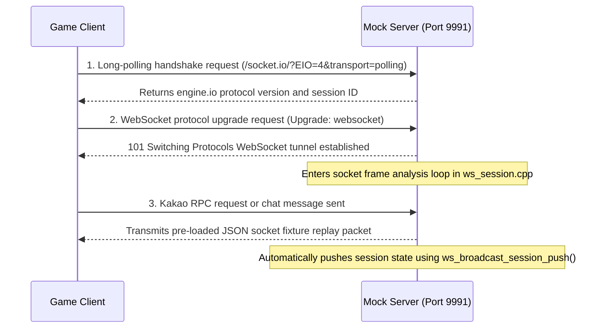

# WebSocket Server Feature Specification (websocket_server.md)

This document details the WebSocket and real-time chat (socket.io) replay features of the Eversoul offline PC server.

---

## 1. Intent of Real-time Communication and Socket Mocking
Within the Eversoul game, there is a background WebSocket channel for real-time message transmission between players, friend activity synchronization, and real-time state transmission of Kakao account sessions. 
To prevent the client from failing the handshake with the socket server and popping up a network disconnection warning in an offline environment, we mock and run a **real-time WebSocket server**.

---

## 2. WebSocket Lifecycle and Handling Mechanism

### 2.1 HTTP Long-Polling Handshake and Upgrade
*   **Long-Polling Bootstrap**: Before the initial WebSocket connection, the client first attempts a normal HTTP request to the polling transport path (`/socket.io/`) of `socket.io` (actually the engine.io wire schema).
*   **Upgrade Confirmation**: When `Connection: upgrade` and `Upgrade: websocket` are confirmed in the HTTP headers of the request, the client connection session is immediately handed over to the dedicated socket frame handler (`handle_websocket`) under the judgment of `is_websocket_upgrade(req)`.

### 2.2 WebSocket Session Frame Parsing (`websocket.cpp` and `ws_session.cpp`)
*   **Frame Decryption**: An infinite receive loop based on a single thread runs, responsible for low-level WebSocket protocol mask key decryption and FIN/Opcode processing.
*   **Kakao JSON-RPC Replay**: For Kakao authentication RPC message packets going back and forth to verify session persistence after game login completion, it searches for, binds, and retransmits pre-recorded JSON-RPC fake response data (`wss/session_replies.json`).
*   **Chat (socket.io) Replay**: It virtually establishes the in-game lobby chat or guild communication port and sends a fake chat message array list (`wss/chat_engineio.json`) to prevent the chat window error from appearing.

---

## 3. Session Push Communication Feature (`ws_broadcast_session_push`)
*   When a user modifies the nickname, gold balance, hero grade, etc., of the player currently playing on the local device in real-time through the Web UI admin screen (`/web/`), a forced update push must be sent to the client via socket communication.
*   When the `ws_broadcast_session_push()` helper function is triggered, it serializes and forcefully broadcasts (Pushes) the updated account's synchronization state message to all currently active and open game socket session connections. This establishes an environment where currencies and heroes are instantly reflected on the UI without the client having to reboot the game.

---

## 4. Source Code Class and Function Design Specifications

The source file structure and function design that handles real-time sessions and chat message replays.

### 4.1 Related Source File Structure
*   **`src/network/websocket/websocket.cpp`**: Low-level WebSocket unmasking, frame send/receive body parsing, and basic ping/pong control.
*   **`src/network/websocket/ws_session.cpp`**: Maintains Kakao session synchronization, the real-time session client list, and stores chat replay payloads.

### 4.2 Major Core Function Design
*   `bool is_websocket_upgrade(const HttpRequest &req)`:
    *   **Role**: Inspects the `Upgrade: websocket` specification in the incoming HTTP request header to determine its authenticity.
*   `void handle_websocket(uint64_t id, int fd, const HttpRequest &req, const std::string &initial_body)`:
    *   **Role**: Generates and transmits the WebSocket handshake response header (`Sec-WebSocket-Accept`), takes over socket control, and runs the frame analysis infinite loop (`ws_session_loop`) as a thread.
*   `void ws_broadcast_session_push()`:
    *   **Role**: Iterates through the active virtual session list (`g_ws_sessions`), serializes the latest synchronization message containing the current user profile state, and forcefully sends it to all clients.
*   `bool socketio_poll_response(const std::string &method, const std::string &query, std::string &out_body)`:
    *   **Role**: Assembles and returns the session creation JSON envelope matching the engine.io polling communication specification that operates before the WebSocket connection.
